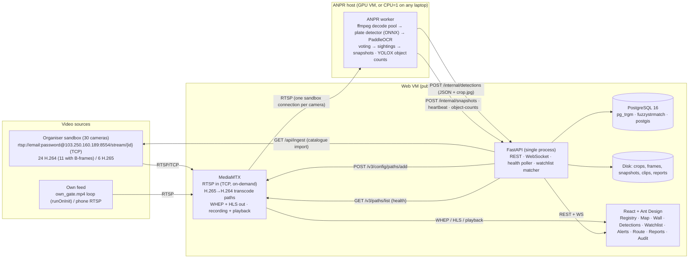

# Sentinel Gujarat

**Unified CCTV registry, GIS, live viewing, ANPR, watchlist alerts and vehicle route reconstruction for Gujarat Police.**
Built by **Dynatech Consultancy** for the Gujarat Police Innovation Challenge 2026 / CCTV Integration Hackathon ("Sentinel"), Category 2 — Model 1 (Centralised CCTV Registry + GIS) **and** Model 2 (Unified Viewing & Metadata Analytics), with Models 3/4 as the documented roadmap.

Version `1.0.0-phase1` · git tag `v1.0-phase1` · 100 % open-source stack (see [`docs/LICENCES.md`](docs/LICENCES.md)) · no cloud AI APIs.

> **New team member?** The clone-to-running-stack guide is [`SETUP.md`](SETUP.md).

| What the jury can do | Where |
|---|---|
| Register every camera on a map (catalogue import, CSV, API push, manual form), watch health and gaps | `/cameras`, `/map`, `/health`, `/gap-analysis` |
| Watch any camera live (WebRTC, HLS fallback, snapshot fallback), 4/9/16 video wall, recorded playback | `/wall`, `/cameras/:id` |
| Read number plates automatically with confidence + crops, count vehicles/persons | `/detections`, `/dashboard` |
| Get alerted within seconds when a watchlisted vehicle appears (toast, sound, browser push) | `/watchlist`, `/alerts` |
| Trace where a vehicle went: timeline + polyline across cameras, PDF export | `/vehicles`, `/vehicles/:plate/route` |
| Export evidence-grade CSV/PDF reports with SHA-256 hashes, audit everything | `/reports`, `/audit` |

## What works today (proven on 5 Sept 2026 on this laptop, CPU only)

Every item below was exercised on a database created from scratch that morning (`down -v` → synth → `up -d --build --wait` → seed) by `scripts/integration_checks.mjs` (105 scripted checks, phases a + b), `frontend/e2e/final_journey.mjs` (31 browser screenshots of the jury journey in `docs/screenshots/final/`, zero console errors) and the manual steps recorded per check in [`docs/acceptance-log.md`](docs/acceptance-log.md):

- **Model 1 registry** — catalogue import of 50 cameras in 2.2 s (first stream ready 1.8 s later), CSV import with row-level errors and a downloadable error report, bulk API with scoped keys, manual form, CSV export with SHA-256 and watermark; GIS map with district boundaries, department/status layers, coverage circles and POIs; gap analysis (PDF + CSV, 3.3 s uncached); health poller with `online / degraded / offline / not_streaming` states and 24 h uptime.
- **Model 2 viewing** — 4/9/16 video wall over WebRTC with HLS fallback and snapshot tiles, the H.265 camera transcoded to H.264, "2 systems" badge (sandbox + own gate), 12 h rolling recording with playback from an alert, evidence clips with hash verification.
- **ANPR and alerts** — 8 live cameras on the CPU (mock loops: 5 fps, contour detector + PaddleOCR; government feed: 2 fps, native decode, tiled ONNX detector, best-shot tracking, `ensemble` OCR — PaddleOCR + fast-plate `cct_xs_v2`), reads with crops, confidence and IST time; watchlist alerts 2–4 s after a read (p95 4.05 s), toast + sound + browser notification, WebSocket and signed webhook delivery, suppression plus a 60 min re-alert window (no alert floods); vehicle search (exact + fuzzy with confirm/reject) and route reconstruction across **two systems** (own gate + sandbox cameras) with speed-plausibility flags and PDF export.
- **Governance** — four roles with department scoping enforced on REST, WebSocket and the HLS/WebRTC proxy (`forward_auth`), append-only audit log, hashed/watermarked reports with an evidence ledger and re-verification, retention job, rate-limited logins with a per-username lock, token revocation on password/role change, CSV formula neutralisation, outbound-URL guard, `/api/internal/*` unreachable through Caddy.
- **Real organiser sandbox (proven the same evening, §4.1)** — the 30 government cameras (`cam01`–`cam30`, `https://cctv.corp8.cloud` catalogue + MediaMTX relay `103.250.160.189`, RTSP over TCP with e-mail + access password) imported through **Settings → Catalogue → Import from Sentinel sandbox**: 30 fetched / 0 added / 30 updated / 0 duplicates in 82–99 s including an ffprobe of every camera (first stream 2–5 s), 47 relay paths (6 H.265 + 11 B-frame H.264 cameras re-encoded to browser-safe H.264), enrichment CSV → districts, departments and location confidence (7 exact / 16 approx / 7 guess) on the map; health 31/31 online; 9-tile wall with real footage (first frame 6–41 s, cold on-demand pulls); credentials masked for all four roles in every endpoint, export, audit row and log (0 hits in a 250-point scan); ANPR readability survey of all 30 cameras and an 8-camera live selection applied; **plates read on the government cameras** (night footage: 12 valid-format reads on cam07 between 20:31 and 22:12 IST, 7 confirmed exact by eye — `GJ32AG2319`, `GJ14AA3978`, `GJ32K0225`, `GJ10OG9093`, `GJ10F0032`, `GJ32AA4959` …), every detected vehicle stored with a timestamped crop, the watchlist seeded with those real plates (`backend/seeds/watchlist_seed.csv` rev 3), the detections page / vehicle search shown on real crops (`sandbox/detections-real.png`, `search-real.png`), and the **government-feed output report** for a 2-hour window — API CSV + PDF with `source=sandbox`, quality PDF from 20 hand-labelled crops, and the evidence PDF of detected vehicles with timestamps and camera ids (`docs/export/evidence_*.pdf`, `docs/tools/build-evidence-report.mjs`). Record: `docs/acceptance-log.md` "Real sandbox (5 Sept)", screenshots `docs/screenshots/sandbox/`.

## Known limitations

- **Real sandbox footage is a 12 h loop of 13/14 June 2026, and everything measured so far is its night half** — every organiser stream is a looped recording (period 12 h 02 min, 1.0×; daylight reaches the screen at 01:44 and 13:46 IST on 6 Sept, `docs/PHASE2-RUNBOOK.md` §4.1) from wide-angle junction PTZ/RLVD presets: plates are 25–110 px at 1080p and, at night, blown out by their own reflection on most cameras. The accuracy pass (`docs/anpr-accuracy.md`) collected 121 native-resolution plate crops from the 8 live cameras in 35 minutes of night footage: **2 were readable by a person** (both cam07, an IR forecourt camera), 48 were signboards or burnt-in captions the detector boxed, the rest blur. On those two plates PaddleOCR (det+rec) reads 1, fast-plate-ocr `cct_xs_v2` reads 1 exactly and the other with one disputed glyph, and the production `ensemble` reads both in valid format with 0 false plates on the 48 negatives; in the final 20-minute live window (21:50–22:10 IST) the 8 cameras produced 50 detected vehicles, 11 OCR reads, 4 in valid format and 1 confirmed correct plate; over the evening cam07 (an IR forecourt camera where vehicles stop) delivered 7 plates confirmed exact by eye out of 20 labelled reads (`GET /api/reports/quality?source=sandbox`: 35 % exact, 58 % character accuracy, all on night footage). The three false *valid* reads carry non-existent state codes (`SI`, `GI`, `OG`): the format check is syntactic and a state-code table is the next filter. The worker decodes natively, detects on a 1280 px copy, tracks each plate and reads its best crop once, drops letters-only OCR strings, and stores every detected vehicle with a timestamped crop under `media/anpr_evidence/` — the "detected vehicles" evidence of the output report (`docs/tools/build-evidence-report.mjs`; a `vehicle_detected` record in the API itself is a backend follow-up). **No daytime accuracy figure exists yet**: re-run `scripts/collect_crops.py`, `scripts/eval_ocr_bank.py` and `scripts/measure_live_anpr.mjs` in the 13:46–17:56 IST window before quoting one. **No watchlist alert and no multi-camera route on a real read yet**: the watchlist now holds the plates read on cam07, but the loop brings each vehicle back only 12 h later and no plate was seen on two organiser cameras (the cameras are 5–300 km apart); both were proven on the mock loops and the own gate.
- **Sandbox streams are lossy at the source** — a direct pull (no relay) gives cam01 279 frames/20 s but cam07 28 frames with decode warnings; ten cameras drop hundreds of RTP packets per second at times, so tiles macroblock, H.265 transcoders restart and 5 cameras delivered no decodable frame within 60 s during the survey. The organiser rules ask to tolerate this; the relay reconnects with 2→30 s backoff and the player restarts its chain. Cold on-demand pulls take 4–40 s before the first frame (45 s player and probe budgets).
- **Mock sandbox still used for the scripted acceptance run** — `MOCK_SANDBOX=1` (50 catalogue rows, 8 synthetic 90 s loops with drawn plates, own-gate loop) remains the fixture for `scripts/integration_checks.mjs` and the measured-figures table; the mock figures (import 2.2 s, OCR 99.3 % valid) are not sandbox figures.
- **Object counts are empty on the laptop** — the synthetic drawings contain no COCO objects and the demo profile sets `OBJECT_DETECT=0`; the YOLOX path only produces counts on real footage.
- **GPU profile not run** — NVDEC/NVENC and the CUDA detector validate with `docker compose config` but the laptop has no GPU; the GPU rows of the scale plan are vendor figures.
- **Never-streamed catalogue cameras** (42 of the 50 mock rows carry `live=false`) show as `not_streaming` rather than `offline` and raise no alert; only a camera that was online and disappears raises the low-priority `camera_offline` alert.
- **Headless gaps** — alert sound and OS notifications are not observable in headless Chrome (a test button exists on `/settings/notifications`); Telegram delivery is untested (no bot token); the PPTX deck was verified structurally and through its PDF twin, not opened in PowerPoint.
- **Single API process** — login rate limits and WebSocket fan-out live in memory; the scale plan moves them to Redis behind a load balancer.
- **No migration tool** — `create_all` plus targeted startup migrations; a schema change after `git pull` may need `deploy/reset-db.sh`.

---

## 1. Architecture



ASCII version:

```
[Sandbox cams] --RTSP/TCP--> [MediaMTX relay] --WHEP/HLS--> [React UI: wall, camera view]
                                   |  (libx264 / NVENC H.265→H.264 for browser paths, fMP4 recording)
                                   +--RTSP--> [ANPR worker (GPU or CPU=1)] --POST detections+crops--> [FastAPI]
                                                                                                        |  matcher + WS fanout in-process
                                                                                                        v
[Sandbox /api/ingest] --import--> [FastAPI] <--> [PostgreSQL: cameras, reads, sightings, watchlist, alerts, events, audit]
[FastAPI health poller] --/v3/paths/list--> [MediaMTX]                  [React UI: registry, map, route, reports, audit]
```

Everything runs as one Docker Compose project (`deploy/docker-compose.yml`):

| Service | Image | Role |
|---|---|---|
| `postgres` | `postgis/postgis:16-3.4` | only datastore (`postgis`, `pg_trgm`, `fuzzystrmatch`) |
| `mediamtx` | `bluenviron/mediamtx:1.20.1-ffmpeg@sha256:16c56911…` (v1.20.1, digest-pinned) | relay: RTSP in over TCP, WHEP/HLS out, recording + playback, transcode paths |
| `api` | `backend/Dockerfile` (python 3.11 + ffmpeg) | FastAPI REST + WebSocket + health poller + watchlist matcher + reports |
| `web` | `frontend/Dockerfile` (node 24 build → caddy 2) | SPA + reverse proxy + automatic HTTPS |
| `anpr-live`, `anpr-preindex` | `anpr/Dockerfile` (`ANPR_BASE=cpu`) | plate reading on live cameras (5 fps) and the whole loop (keyframes) — profile `cpu` (pre-index worker alone: `--profile preindex up -d anpr-preindex`) |
| `anpr-live-gpu`, `anpr-preindex-gpu` | `anpr/Dockerfile` (`ANPR_BASE=gpu`, CUDA + NVDEC) | same workers on the NVIDIA VM — profile `gpu` |
| `synth` | `scripts/Dockerfile` | one-shot synthetic camera video generator — profile `tools` |

The integration contract every component follows (ports, env vars, JSON shapes, MediaMTX paths, file layout, acceptance checks) is [`docs/CONTRACT.md`](docs/CONTRACT.md). The high-level design, scale plan and licence inventory are under [`docs/`](docs/).

---

## 2. Quick start on a Windows laptop (CPU only, no GPU, no local Python)

Prerequisites: Docker Desktop (WSL2 backend, ≥ 8 GB memory and ≥ 6 CPUs allotted in *Settings → Resources*), Git. Node 24 is only needed for frontend development. Every command below runs from the repository root in PowerShell or Git Bash.

```powershell
git clone https://github.com/dynatech-consultancy/sentinel-gujarat.git
cd sentinel-gujarat
Copy-Item deploy/.env.example deploy/.env          # cp deploy/.env.example deploy/.env

# 1. synthetic "sandbox" videos (8 cameras × 90 s loops, 159 s on this laptop; camera 8 is H.265; encoded without B-frames so WebRTC plays them)
docker compose -f deploy/docker-compose.yml --env-file deploy/.env --project-directory . --profile tools run --rm synth

# 2. build and start everything and wait until every healthcheck passes (first build 5-10 min; profile cpu is the default).
#    The API runs create_all + the seed itself on its first start (SEED_ON_START=1), so --wait also covers seeding.
docker compose -f deploy/docker-compose.yml --env-file deploy/.env --project-directory . up -d --build --wait --wait-timeout 600

# 3. (optional) re-run the idempotent seed by hand - only after step 2 has returned, never concurrently with the
#    API's own first start (two seeds racing on an empty database can trip each other on CREATE EXTENSION)
docker compose -f deploy/docker-compose.yml --env-file deploy/.env --project-directory . exec api python -m app.seed

# 4. watch it come up
docker compose -f deploy/docker-compose.yml --env-file deploy/.env --project-directory . ps
curl http://localhost/healthz
```

Open **http://localhost** and log in:

| Username | Role | Default password (`deploy/.env`) | Sees |
|---|---|---|---|
| `jury_admin` | admin | `JURY_ADMIN_PASSWORD` = `Sentinel@Admin2026` | everything, settings, audit |
| `jury_operator` | operator | `JURY_OPERATOR_PASSWORD` = `Sentinel@Ops2026` | watchlist, alerts, route, reports; no camera edits |
| `jury_viewer` | viewer | `JURY_VIEWER_PASSWORD` = `Sentinel@View2026` | read-only |
| `dept_admin_police` | dept_admin | `DEPT_ADMIN_PASSWORD` = `Sentinel@Police2026` | Police cameras only (department scoping) |

Then follow the demo journey: **Cameras → Import → Import from catalogue** (50 mock cameras appear, 8 of them live from `stream/1..8`), **Map**, **Video wall**, **Camera page** (live reads), **Watchlist → add `GJ 27 XY 3456`** (alert within one 90 s loop), **Vehicle search → route → PDF**, **Reports**. The header shows a `MOCK SANDBOX` badge because `MOCK_SANDBOX=1`: the API serves an organiser-shaped catalogue at `http://localhost/api/mock-sandbox/api/ingest` and MediaMTX serves the synthetic loops under the organiser's URL shape `rtsp://mediamtx:8554/stream/<id>`, so the exact import → relay → ANPR → alert → route path is exercised locally.

`make` users: `make env synthetic up` does steps 1–2 (`make seed` is step 3) (`make help` lists every target; Windows: `choco install make` or run the commands above).

Useful local URLs: API docs `http://localhost/api/docs` · MediaMTX control API `http://127.0.0.1:9997/v3/paths/list` · RTSP `rtsp://127.0.0.1:8554/stream/1` (VLC, TCP) — the MediaMTX ports are bound to `127.0.0.1` only (`MTX_BIND` in `.env`).

CPU sizing: the default `.env` caps the live worker at 3 cameras (`ANPR_MAX_CAMERAS=3`). Cameras that are `anpr_enabled` but beyond the cap get no ANPR at all (the pre-index worker skips them as "covered live"), so on a ≥ 8-core laptop use the validated demo profile in `deploy/.env`: `ANPR_MAX_CAMERAS=8`, `ANPR_DETECTOR=contour` (the drawn synthetic plates are found by the contour detector; `auto` gives the same reads at +43 ms/frame for the ONNX pass), `OBJECT_DETECT=0` (YOLOX finds no COCO objects in the synthetic drawings and costs ~0.4 s per call on this CPU), `ANPR_LIVE_MEMORY=4g`. That runs all eight synthetic cameras at 5 fps and gives the full `GJ01AB1234` route (cameras 1 → 3 → 6 → 2) and the `GJ18CD5678` route through the H.265 camera 8, which is transcoded for browsers with `libx264` (`MEDIAMTX_TRANSCODE=cpu`).

Final-acceptance journey screenshots: `cd frontend && node e2e/final_journey.mjs` (the jury journey of MVP-PLAN §3.6 step by step — import, API docs, registry, export hash, map layers, wall 9-grid + HLS switch, live reads, watchlist add → toast → acknowledge, search → route → PDF, output report, recording playback + evidence clip, verify, health, gap, dashboard, audit — plus the landing page of each jury role, into `docs/screenshots/final/` with `console-errors.json` and `journey.json`). Live-stack screenshots for the documents: `cd frontend && node e2e/live_screenshots.mjs` (Playwright + the locally installed Google Chrome; logs in through the real form, captures every route, the 4/9/16 wall, the alert toast, a 1024 px tablet pass and the `jury_viewer` role into `docs/screenshots/live/`).

### Measured on a 12-core laptop, CPU only

Intel i5-1345U (12 threads), 16 GB RAM, Windows 11 + Docker Desktop (WSL2, 12 vCPU / 7.6 GB), no GPU. Everything below was measured on the mock sandbox (50 catalogue cameras, 8 synthetic live streams + the own-gate loop) on 5 Sept 2026 with the demo profile above; the per-check record is `docs/acceptance-log.md`.

| Figure | Measured |
|---|---|
| Image builds | api 167 s cold (`--no-cache`) / 13 s warm · web 93 s cold (npm ci + vite build) / 27 s warm · anpr 13–16 s warm (cold build downloads PaddleOCR models + ONNX weights) · synth 9 s; ANPR image 2.66 GB, API image 1.24 GB |
| Synthetic media (8 × 90 s, 720p, cam 8 H.265) | 118–159 s in the `synth` container |
| Stack RAM (docker stats) | api 150 MB · web 15–30 MB · mediamtx 170–330 MB · postgres 85–110 MB · anpr-preindex 0.6 GB · anpr-live 2.0 GB at start, 2.3 GB RSS after 40 min (cap 4 GB) ⇒ ≈ 3.3–4.3 GB total |
| Stack CPU (8 live cameras, wall with 9 WebRTC viewers) | anpr-live 190–270 % · mediamtx 15–80 % (recording 9 paths + one libx264 transcode) · api 7–14 % · postgres 2–3 % |
| Fresh clone → running stack | `docker compose up -d --build` 27 s with warm images, `/healthz` ok 3 s later (seed of 27 departments, 4 users, 2 keys, 52 POIs, 33 districts, 23 watchlist rows included) |
| Catalogue import of 50 cameras (fetch → upsert → 61 relay paths → first stream) | 2.2 s on the fresh stack of the final run (`duration_ms` 2190, of which the first on-demand stream took 1 821 ms); 2.6–3.9 s on earlier runs; second run, 50 unchanged: 14–44 ms |
| First stream after import (idle on-demand pull → HLS manifest) | 1.8–2.1 s cold (`first_stream_ready_ms` 1821 / 2066), 12–44 ms on a warm path |
| Health poller settle (8 live + own online, 42 catalogue rows `not_streaming`) | 120–161 s (two to three 60 s ticks; `not_streaming` after 3 consecutive not-ready checks, no alert for a camera that never streamed) |
| Relay outage recovery (MediaMTX stopped for ≈ 3 min) | the 9 streaming cameras `offline` with 9 low-priority `camera_offline` alerts after 3 ticks (161 s), catalogue rows stay `not_streaming` and raise nothing; all 9 alerts auto-closed "Camera back online" on the first tick (60 s) after the restart; decoders reconnect with 2→30 s backoff |
| ANPR worker, 8 cameras, `CPU=1`, contour detector | decode 5.0 fps per camera (40 fps total); inference 19–21 frames/s (≈ 50 % of decoded frames, newest-frame policy); contour detect 4–9 ms/frame; PaddleOCR 270–470 ms per crop; 70–85 % of plate appearances yield a voted read |
| ANPR worker, 6 cameras + YOLOX every 25th frame | 190 % CPU; YOLOX 370–650 ms per call (no counts on the synthetic drawings) |
| Read → alert latency (`alerts.latency_ms`; 3 s vote window + 1 s batch) | final run p50 3.4 s · p95 4.05 s · max 4.05 s (n = 11); earlier fresh run p50 3.2 s · p95 4.4 s (n = 14); steady state p50 3.3 s · p95 4.0 s · max 4.1 s (8 cameras, n = 13 in 9 min); over the whole 1 h run p50 3.4 s · p95 6.2 s, with 11–22 s outliers only at an API restart and while headless Chrome decoding 9 WebRTC tiles pushed the 16 GB host into memory pressure (the Docker VM froze for up to 13 s) |
| Watchlist add → first WebSocket alert | 10–15 s (next appearance of `GJ27XY3456`; final run 10 s, latency 2.2 s; browser toast 7 s after the form submit), alert latency 2.2–3.7 s; webhook delivery to the mock sink 15 s after the add; the read 90 s later on the same camera was attached by suppression (`alert_update`, `read_count` 2) |
| API cost per worker request | `/internal/detections` 15–40 ms, `/internal/snapshots` 12–20 ms, heartbeat < 70 ms, at ≈ 16 internal requests/s |
| Vehicle search / route (36 sightings, 5 cameras; final run 20 stops on 5 cameras incl. the own gate, 222 km) | search 60–120 ms, route 100–200 ms, route PDF 0.6 s (72–194 KB) |
| Output report, 2 h window (68 reads) | CSV 19 KB / 0.2 s, PDF 465 KB / 1.4 s |
| Gap analysis (60 cameras, 33 districts, 500 m grid, 237 k empty cells) | 4.0–8.8 s uncached, < 100 ms cached (5 min TTL) |
| DB size (rows + indexes) | 2.5 MB per 1,000 sightings including their reads (23 MB total with the 33 district polygons) |
| Evidence files | crop 7.1 KB and best frame 30.7 KB per sighting (JPEG q70, 960 px frames); recordings ≈ 120 MB per camera-hour for the 720p synthetic loops (~300 kbps) |
| Frontend build | 33 s, `dist/` 4.0 MB (antd 1.41 MB, hls.js 594 KB, app 424 KB, charts 382 KB, leaflet 184 KB) |

What the laptop run cannot show: NVDEC/NVENC (GPU profile), Telegram, and object counts (the synthetic drawings contain no COCO objects; use `OBJECT_DETECT=1` on real footage). The organiser's real catalogue and streams were exercised separately the same day — see §4.1 and the "Real sandbox (5 Sept)" section of `docs/acceptance-log.md`.

Stop / reset:

```bash
docker compose -f deploy/docker-compose.yml --env-file deploy/.env --project-directory . down      # keep data
bash deploy/reset-db.sh --yes                                                                     # drop DB volume, re-seed
docker compose -f deploy/docker-compose.yml --env-file deploy/.env --project-directory . down -v  # wipe everything
```

---

## 3. Quick start on the GPU VM (Ubuntu 22.04, T4 or better)

Ports to open: **80/tcp, 443/tcp, 8189/tcp + 8189/udp** (WebRTC ICE). DNS `A` record for your domain → VM public IP.

```bash
# fresh VM (installs Docker + Compose + NVIDIA container toolkit, clones, configures, builds, seeds)
curl -fsSL https://raw.githubusercontent.com/dynatech-consultancy/sentinel-gujarat/main/deploy/deploy.sh \
  | bash -s -- --domain sentinel.example.in --email ops@example.in --gpu \
      --sandbox-url http://<sandbox-host> --sandbox-auth basic --sandbox-user <user> --sandbox-password <password>

# or from a clone
./deploy/deploy.sh --domain sentinel.example.in --email ops@example.in --gpu --sandbox-url http://<sandbox-host> ...

# IP-only VM (no DNS yet): no HTTPS, but WebRTC must still advertise the public address
./deploy/deploy.sh --gpu --public-ip 203.0.113.10
```

`deploy.sh` writes `deploy/.env` (`COMPOSE_PROFILES=gpu`, `MEDIAMTX_TRANSCODE=nvenc`, `CADDY_SITE_ADDRESS=<domain>`, `PUBLIC_BASE_URL`/`CORS_ORIGINS=https://<domain>`, `COOKIE_SECURE=1`, `MTX_WEBRTCADDITIONALHOSTS=<public ip>` — auto-detected via api.ipify.org whenever `--public-ip` is not given, with an explicit warning when detection fails and the value is still `127.0.0.1`), then runs

```bash
docker compose -f deploy/docker-compose.yml -f deploy/docker-compose.gpu.yml --env-file deploy/.env --project-directory . up -d --build
```

The `gpu` profile replaces the CPU workers with `anpr-live-gpu` / `anpr-preindex-gpu` (`CPU=0`, NVDEC decode via `-hwaccel cuda`, `onnxruntime-gpu`) and `docker-compose.gpu.yml` rebuilds MediaMTX from `deploy/mediamtx-nvidia.Dockerfile` (same MediaMTX binary on `jrottenberg/ffmpeg:6.1-nvidia2204`) so the `cam_<id>_h264` transcode paths use `h264_nvenc`. Caddy obtains the Let's Encrypt certificate on first request.

**Every later compose command on the VM must include `-f deploy/docker-compose.gpu.yml`** (`up`, `down`, `logs`, `ps`, `restart`, `pull`): compose profiles cannot rewrite a service, so without the override `up` recreates `mediamtx` from the stock non-NVENC image while the API keeps emitting `h264_nvenc` commands and every H.265 camera goes black. `deploy.sh`, `deploy/reset-db.sh` and the `Makefile` add the file automatically when `deploy/.env` says `COMPOSE_PROFILES=gpu` (`make help` prints the resolved command).

**Catalogue on the hosted stack.** `--domain` sets `MOCK_SANDBOX=0`: the public portal never shows the `MOCK SANDBOX` badge, never imports the 50 mock cameras and does not expose the unauthenticated `/api/mock-sandbox/*` catalogue + webhook sink. Pass the organiser sandbox with `--sandbox-url http://<host>` (`--sandbox-auth none|basic|bearer|header`, `--sandbox-user`, `--sandbox-password`, `--sandbox-header "Name: value"`) so the first `Import from catalogue` already hits the real endpoint; without it `deploy.sh` warns and you set the host in **Settings → Catalogue** (§4). `--mock` keeps the mock on purpose (rehearsal VM). With a real `--sandbox-url` the synthetic videos are skipped (`--synth` forces them).

**Security on the hosted stack.** When `deploy.sh` creates `deploy/.env` it generates a fresh `POSTGRES_PASSWORD` (32 hex characters, so the `DATABASE_URL` compose builds needs no URL-encoding), `JWT_SECRET`, `INTERNAL_API_KEY` and `BULK_API_KEY` (the documented `sentinel` / `change-me…` / `sk_internal0000…` / `sk_bulk0000…` values from `.env.example` only exist on a hand-copied file). On a public deployment (`--domain`, or an existing `.env` with `COOKIE_SECURE=1` / `https` `PUBLIC_BASE_URL`) the audit is **fatal** for a default `POSTGRES_PASSWORD`, `JWT_SECRET` (or one shorter than 32 characters) or API key — the API's own start-up guard refuses to boot with them, so the script stops before the build instead of waiting ten minutes for a crash-looping container; the four jury passwords are only warned about (they are entered in the portal form). Caddy answers `404` for `/api/internal/*` from the Internet (the ANPR workers post to `api:8000` inside the compose network), sends `Strict-Transport-Security` on the TLS site and a Content-Security-Policy / `Permissions-Policy` on the SPA, and its JSON access log redacts `?token=` (the WebSocket / media-element fallback) as well as the `Authorization` and `Cookie` headers; the MediaMTX RTSP/WHEP/HLS ports are bound to loopback (`MTX_BIND`) and the unauthenticated control API (9997) / playback (9996) ports stay on loopback unconditionally.

**Changing the database password later.** The postgres image applies `POSTGRES_PASSWORD` only when it initialises an empty volume, while compose rebuilds `DATABASE_URL` from `deploy/.env` on every `up` — editing the file alone leaves the API crash-looping with `password authentication failed`. Use `./deploy/rotate-db-password.sh --generate` (or `make rotate-db-password`): it runs `ALTER USER … PASSWORD` inside `sentinel-postgres` over the trusted local socket, verifies the new value over TCP, writes it to `deploy/.env` and recreates `api`. Hand-chosen values must be URL-safe (`[A-Za-z0-9_.-]`, e.g. `openssl rand -hex 16`): `@ # ? % /` break the URL and `$` breaks compose interpolation. A throw-away database can instead be re-initialised with `bash deploy/reset-db.sh --yes`.

**Before the hosted demo:** change the four `JURY_*_PASSWORD` / `DEPT_ADMIN_PASSWORD` values in `deploy/.env` (`deploy.sh` warns for each one still at its default) and write them into the portal submission form, never into the repository. Nightly backups are installed by `deploy.sh --domain` (`./deploy/backup.sh --install-cron` in the deploying user's crontab, `--no-cron` to skip; verify with `crontab -l | grep backup.sh`): pg_dump one hour after the retention purge (`RETENTION_JOB_HOUR_UTC` + 1 = 22:00 UTC / 03:30 IST), gzip, SHA-256, 14-day retention, `umask 077` into a `0700` `backups/` directory because the dump carries the settings table (catalogue credentials, Telegram token, webhook secrets); set `BACKUP_PASSPHRASE` in the crontab line to AES-256-encrypt every dump (`--restore` needs the same variable).

Validate the GPU profile without a GPU (it renders on any machine):

```bash
COMPOSE_PROFILES=gpu docker compose -f deploy/docker-compose.yml -f deploy/docker-compose.gpu.yml --env-file deploy/.env --project-directory . config --quiet
```

---

## 4. Pointing at the organiser sandbox (or the Phase 2 environment)

### 4.1 Connecting to the organiser sandbox (verified 5 Sept 2026)

The real sandbox publishes a catalogue (`https://cctv.corp8.cloud/cameras.json`, behind the portal login) that lists only `id` (`cam01`…`cam30`) and `name`, and 30 RTSP/WHEP streams on a MediaMTX relay (`103.250.160.189`, RTSP 8554 over TCP, WHEP 8889) authenticated with the registered **e-mail** and a separate **access password** embedded in the URL (`rtsp://<e-mail with @ as %40>:<access password>@103.250.160.189:8554/stream/cam01`; path ids are lower-case and case-sensitive; only cam01–05 carry SDP titles, the names come from `cameras.json`). Coordinates, districts and departments are not provided, so the team enrichment CSV (`media/cameras_enrichment.csv`, confidence-flagged, see `media/cameras_enrichment.README.md`) supplies them. Exact steps (each verified 5 Sept 2026 on this laptop):

1. **Environment variables.** Put the stream credentials in `deploy/.env` (never in the repository, docs or screenshots): `SANDBOX_STREAM_EMAIL=<registered e-mail>` and `SANDBOX_STREAM_PASSWORD=<access password>`; optionally `CATALOGUE_SOURCE=sentinel_portal` (pre-selects the source), `SANDBOX_PORTAL_EMAIL` / `SANDBOX_PORTAL_PASSWORD` (portal login, so the API can download `cameras.json` itself), `SANDBOX_PROBE_TIMEOUT_S=45` (default 30; cam15 / cam30 answer in 18–38 s) and `SANDBOX_STREAM_HOST` / `SANDBOX_RTSP_PORT` / `SANDBOX_WHEP_PORT` if the organiser moves the relay. Then `docker compose -f deploy/docker-compose.yml --env-file deploy/.env --project-directory . up -d --no-deps api web`. The values seed the `sandbox.*` / `catalogue.*` settings on first start; afterwards the settings table wins (`Settings → Catalogue` or `PUT /api/settings`). The `api` container mounts `./media` read-only at `/app/media`, so the saved catalogue copy `media/cameras.json` and the enrichment CSV are available without an upload.
2. **Settings → Catalogue** (as `jury_admin`) → set **Where cameras come from** to *Organiser Sentinel sandbox*; check host `103.250.160.189`, ports 8554 / 8889, the e-mail and the access password (shown masked once saved; leave the field untouched to keep it) → **Save**. The `MOCK SANDBOX` badge disappears and the About page names the real source (`ui-settings-catalogue.png`, `ui-about.png` in `docs/screenshots/sandbox/`).
3. **Test cam01 with these credentials** on the same tab → expect `cam01: H.264 1920x1080 @ 30 fps` plus "30 cameras from /app/media/cameras.json" and the enrichment path. Upload a newer enrichment CSV here if the team corrected locations.
4. **Cameras → Import → Import from Sentinel sandbox.** Upload `cameras.json` (a fresh download from the portal) or leave it empty to use the portal login (if configured) or the saved copy; optionally attach an enrichment CSV; keep *Probe every camera* on. Every camera is ffprobed directly over RTSP/TCP (6 at a time, `sandbox.probe_timeout_s` cap; one short connection per camera, closed when done) to fill codec / resolution / fps (reported fps is unreliable — cam06 says 90000/1 — so it is stored only when 1–60 and timing is PTS-driven anyway) / live / B-frames. Measured: **30 fetched · 0 added · 30 updated · 0 unchanged · 0 errors, 47 relay paths, 82–99 s** including the probes, first stream ready 2–5 s (`proof-import.png`). The 6 H.265 cameras (cam06, cam12, cam17, cam18, cam22, cam26) and the 11 B-frame H.264 cameras (cam07, cam08, cam09, cam10, cam11, cam21, cam24, cam25, cam27, cam28, cam29 — MediaMTX refuses a WebRTC reader for them and its HLS muxer dies on the reorder chain) get a `cam_<id>_h264` libx264 re-encode (720p `ultrafast` on the CPU, NVENC on the GPU profile; tile caption "H.264 (re-encoded)"). Several sandbox streams are lossy at the source (hundreds of RTP packets lost per second, verified with a direct pull): expect macroblocking, restarting H.265 transcoders and tiles that come and go — the organiser rules ask to tolerate gaps. Re-running never duplicates a camera: rows first loaded through the CSV path (`source=csv`, ids 61–90) were converted in place to `source=sandbox`, keeping id, relay path and ANPR assignment.
5. **Check the map and health.** Solid markers are exact locations, dashed rings approximate, hollow rings guesses (tooltip "Approximate location (team-inferred)"); the camera drawer shows the confidence and the team's note; district boundaries come from the enrichment districts (Ahmedabad 9, Navsari 7, Junagadh 5, …). `/health` reaches 31/31 online within two 60 s ticks (the poller probes external sources directly with the same 45 s cap, ≤ 6 at a time, an idle camera at most every 300 s — "pace your load").
6. **Pick the ANPR cameras.** `docs/anpr-camera-selection.md` ranks all 30 by plate readability; the applied live set on the laptop is cam01, cam02, cam04, cam05, cam07, cam12, cam14, cam16 (`ANPR_MAX_CAMERAS=8`; a GPU VM adds cam08, cam13, cam15, cam30 with `ANPR_MAX_CAMERAS=12`), the rest stay on the pre-index worker. For real reads the worker runs the real-feed profile already in `deploy/.env` (`ANPR_DETECTOR=onnx FRAME_WIDTH=0 ANPR_DETECT_WIDTH=1280 ANPR_DET_TILE=768 ANPR_MIN_PLATE_W=28 ANPR_FPS=2 ANPR_OCR=ensemble ANPR_OCR_FAST_MODEL=cct_xs_v2_global ANPR_BEST_SHOT=1`, GPU values next to each key) after `build anpr-live` / `up -d --no-deps anpr-live anpr-preindex` (see "Known limitations" and `docs/anpr-accuracy.md`).

Credentials never leave the API: every response, CSV export, audit row, import warning, probe error and log line shows `rtsp://<e-mail>:***@…` for every role; only the MediaMTX relay receives the real URL, and the ANPR worker reads from the relay. The mock catalogue (`catalogue.source = mock`, `MOCK_SANDBOX=1`) stays available for laptop tests and the integration checks.

### 4.2 Generic `/api/ingest` catalogue host

The generic `/api/ingest` importer is a run-time setting too, so a Phase 2 environment that exposes the organiser-shaped JSON is onboarded in minutes without a redeploy (plan R12):

1. Log in as `jury_admin` → **Settings → Catalogue**.
2. Set **Base URL** to `http://<sandbox-host>` (the importer calls `{base_url}/api/ingest`), the auth type (`none` / `basic` / `bearer` / `header`) and credentials from the portal's Resources page.
3. **Test connection** — shows the camera count and any `unmapped_fields`; adjust the field map (ordered candidate paths per target field, e.g. `location.lat`) if the catalogue shape differs. Wrapper objects (`cameras`, `data`, `items`, `results`, `streams`) are unwrapped automatically; department display names map through aliases (`seeds/departments.csv`); unknown departments land in `UNASSIGNED` with a warning.
4. **Cameras → Import → Import from catalogue.** The summary reports fetched/added/updated, relay paths created, ANPR-enabled cameras and the measured onboarding time plus time-to-first-stream.

The same values can be pre-seeded in `deploy/.env` (`MOCK_SANDBOX=0`, `SANDBOX_BASE_URL`, `SANDBOX_AUTH_TYPE`, `SANDBOX_USERNAME`, `SANDBOX_PASSWORD`, `SANDBOX_AUTH_HEADER`) — they are only the initial values of the settings. Every camera stream, sandbox or own, goes through MediaMTX (`cam_<id>` on-demand path, RTSP over TCP, one upstream connection per camera shared by browsers and the ANPR worker); the catalogue's own WHEP/HLS URLs are stored for reference only. CSV import (`Cameras → Import → CSV`, template download) is the fallback if the on-site catalogue has no API.

Own / private cameras: **Cameras → Add camera** with any RTSP URL (`rtsp://mediamtx:8554/own_gate` for the bundled loop, or a phone RTSP app), `ownership=private` — visible on the map, the wall and in ANPR within a minute.

---

## 5. How the demo videos were produced

> **Status (5 September 2026 IST): not yet recorded.** This section is the production plan. It is replaced by the factual account — recording dates in IST, the hosted URL used, whether `media/own/own_gate.mp4` was a real phone recording or the synthetic fallback, and sandbox versus mock catalogue — immediately after recording, per `docs/video-scripts.md` §3 step 5. Nothing below claims a recording that has not happened.

**Plan**

- **Video 1 (own feed):** a phone will record the Dynatech office gate at 1080p (daytime, frontal plates) and the file will be dropped into `media/own/own_gate.mp4` (git-ignored; the directory currently holds only `.gitkeep`). MediaMTX loops it as `own_gate` (`deploy/mediamtx.yml`, `runOnInit` ffmpeg `-stream_loop -1 -c copy`); when the file is absent the path falls back to synthetic camera 1, so the flow is demoable either way and the final account will state which one was on screen. The camera will be added through **Add camera** as `OWN-GATE-01` (`ownership=private`) and the alert → route → report flow will be captured with OBS Studio at 1080p from the hosted URL.
- **Video 2 (government feed):** to be recorded against the organiser sandbox imported through **Import from catalogue** (`MOCK_SANDBOX=0`) once the sandbox credentials arrive; if the sandbox is unreachable on the recording day, the video will be recorded against the mock catalogue (`MOCK_SANDBOX=1`) and the synthetic set, and both the video and this section will say so.
- Editing will be limited to trims and pauses while waiting for the next loop pass; no mock-ups.

**Facts that hold today (local rehearsal)**

- The synthetic set comes from `scripts/make_synthetic_videos.py` (run through the `synth` container): 8 cameras × 90 s with six fixed anchor plates on a fixed schedule (`GJ01AB1234` on cameras 1→3→6→2, `GJ18CD5678` incl. the H.265 camera 8, two-line `MH02BZ7788`, BH-series `22BH4321AA`, …) plus seeded filler plates; ground truth is `media/synthetic/plates.json`. Because every camera loops every 90 s, the route plausibility check flags each leg as `implausible_speed` — shown as an amber badge, which is the correct behaviour on looping footage.
- Screenshots for the documents: `make screenshots` (runs `deploy/screenshots.mjs` in the `mcr.microsoft.com/playwright:v1.47.2-jammy` container, which ships browsers only, so the target first installs the matching `playwright@1.47.2` package inside the container - Internet access needed; logs in as `jury_admin`, captures every page into `docs/screenshots/`). The live-stack set used in the documents came from `cd frontend && node e2e/live_screenshots.mjs` (local Google Chrome, see §2).
- Timing evidence for the scale plan (onboarding time, first-stream time, read → alert latency, reads/s, cameras per worker) comes from the import summary, `alerts.latency_ms` and the worker heartbeats shown on `/health`, as recorded in `docs/acceptance-log.md`.

**Recorded (fill in after recording)**

| Video | Recorded on (IST) | Hosted URL | Feed source | Own-gate file |
|---|---|---|---|---|
| 1 — own feed | _pending_ | _pending_ | _pending_ | _pending: real phone recording / synthetic fallback_ |
| 2 — government feed + output report | _pending_ | _pending_ | _pending: organiser sandbox / mock catalogue_ | — |

---

## 6. Repository layout

```
sentinel-gujarat/
├── README.md                     # this file
├── Makefile                      # up/down/seed/synthetic/logs/test/screenshots wrappers
├── deploy/
│   ├── docker-compose.yml        # postgres, mediamtx, api, web, anpr-live, anpr-preindex, *-gpu (profile gpu), synth (profile tools)
│   ├── docker-compose.gpu.yml    # NVENC MediaMTX build + MEDIAMTX_TRANSCODE=nvenc overrides
│   ├── docker-compose.debug.yml  # publishes 5432 and MediaMTX RTSP/WHEP/HLS on all interfaces (dev only; `ports: !override`, or set MTX_BIND=0.0.0.0 in .env); 9996/9997 stay on loopback
│   ├── mediamtx.yml              # relay config: TCP sources, on-demand, WHEP/HLS, recording, stream/1..8 + own_gate loops
│   ├── mediamtx-nvidia.Dockerfile
│   ├── Caddyfile                 # SPA + /api, /ws, /media → api; /mtx → MediaMTX (forward_auth); /playback → MediaMTX
│   ├── .env.example              # every variable of CONTRACT §1.3 with laptop-safe defaults
│   ├── deploy.sh                 # Ubuntu 22.04 one-shot install/deploy; reset-db.sh; rotate-db-password.sh; backup.sh; screenshots.mjs
├── backend/                      # FastAPI (app/, seeds/, tests/, Dockerfile)
├── anpr/                         # ANPR worker (pipeline, decode, detector, ocr, normalise, voting, Dockerfile, weights/)
├── frontend/                     # React + TypeScript + Ant Design SPA (Dockerfile = node build → caddy)
├── scripts/                      # make_synthetic_videos.py, survey_sandbox.py, Dockerfile (synth)
├── media/                        # synthetic/, own/, fallback/ video inputs (see media/README.md)
└── docs/                         # CONTRACT.md, HLD, SCALE-PLAN, LICENCES.md, video scripts, submission checklist, diagrams/
```

Ports (host): `80`/`443` web; `8189` tcp+udp WebRTC ICE; `127.0.0.1:8554/8888/8889/9996/9997` MediaMTX diagnostics. Inside the compose network: `api:8000`, `mediamtx:8554/8888/8889/9996/9997`, `postgres:5432`.

Data lives in named volumes: `sentinel_pgdata` (database), `sentinel_sentinel_data` (`/data`: crops, frames, snapshots, clips, reports — all SHA-256 hashed), `sentinel_recordings` (MediaMTX fMP4 segments, 12 h rolling), `sentinel_caddy_data` (certificates). All timestamps are stored in UTC and rendered in IST (`Asia/Kolkata`) in the UI and in every export.

---

## 7. Tests, checks and troubleshooting

```bash
docker compose -f deploy/docker-compose.yml --env-file deploy/.env --project-directory . run --rm --no-deps api pytest -q   # backend: 190 tests (20 normalisation vectors, route, RBAC, CSV import, matcher, seeds, catalogue mapping, hardening, health state machine)
docker run --rm sentinel-anpr:cpu python -m pytest -q anpr/tests                                                              # ANPR worker: 63 tests (normalisation, voting, sightings, contour detector, objects/zones, config/client)
cd frontend && npm ci && npm run typecheck && npm run lint && npm run build                                                   # frontend: strict TypeScript, eslint --max-warnings=0, dist/ 4.0 MB
```

Results on 5 Sept 2026 (final acceptance run): backend `190 passed in 4.55 s`, ANPR `63 passed in 2.10 s`, frontend typecheck/lint/build clean (33 s).

The 30 acceptance checks of `docs/CONTRACT.md` §13.3 are scripted in `scripts/integration_checks.mjs` (Node 24, no dependencies): `node scripts/integration_checks.mjs a` on a fresh database (registry, streams through Caddy, imports, RBAC, gap analysis, health poller), then `node scripts/integration_checks.mjs b` once the ANPR workers have run for two minutes (reads, alerts over WebSocket, route + PDF, reports, clips + evidence, reader-kick discontinuity, settings, webhook, rate limit). Results and downloaded files land in `scripts/out/` (measurements in `scripts/measurements.json`); `docs/acceptance-log.md` records the final 5 Sept run (phase a 54 checks, phase b 51 checks).

The 30 acceptance checks in [`docs/CONTRACT.md` §13.3](docs/CONTRACT.md) walk the whole system on the laptop in order (synthetic media → stack → login → import → streams → health → ANPR → alerts → route → reports → RBAC → recordings → settings → audit).

| Symptom | Check |
|---|---|
| `docker info` fails on Windows | Docker Desktop is still starting; wait and retry (`deploy.sh` cannot start it for you) |
| `stream/1..8` never become ready | `media/synthetic/cam_*.mp4` missing → run the `synth` profile; the MediaMTX publisher waits for the files |
| Wall tiles fall back to HLS | UDP/TCP 8189 blocked or `MTX_WEBRTCADDITIONALHOSTS` is not the public IP (still `127.0.0.1` on an IP-only VM → re-run `deploy.sh --public-ip <ip>`); HLS fallback is automatic after 5 s |
| `api` restarts with `password authentication failed` | `POSTGRES_PASSWORD` in `deploy/.env` was edited after the volume existed → `./deploy/rotate-db-password.sh --generate` (or `--password <value>`), see §3 |
| `deploy.sh` stops with "cannot start with default secrets" | hand-copied `.env` on a `--domain` deployment; generate `JWT_SECRET` / API keys as printed and rotate the DB password with the script above |
| H.265 camera is black | it plays through `cam_<id>_h264`; check `docker compose logs mediamtx` for the ffmpeg transcode; on the VM use the `gpu` profile (NVENC) |
| Cameras `offline` after a MediaMTX restart | expected for one poll; the API re-adds lost runtime paths on its next health tick |
| Schema changed after `git pull` | `bash deploy/reset-db.sh --yes` (create_all, no migrations during the hackathon) |
| `caddy` certificate errors | domain must resolve to the VM and ports 80/443 must be reachable; `CADDY_EMAIL` is optional |

---

## 8. Licences and credits

Every runtime component is open source; the inventory with versions, licences and the pinned image digests is [`docs/LICENCES.md`](docs/LICENCES.md) (React, Ant Design, Leaflet, hls.js — MIT/BSD; FastAPI, MediaMTX, Caddy, PaddleOCR, open-image-models, YOLOX — MIT/Apache-2.0; PostgreSQL/PostGIS — PostgreSQL/GPL; ffmpeg — LGPL/GPL build noted). The optional Ultralytics fallback detector is AGPL-3.0 and is disclosed wherever it is used.

The team's own code (everything in this repository authored by Dynatech Consultancy) is released under the MIT License — `SPDX-License-Identifier: MIT`, see [`LICENSE`](LICENSE), Copyright 2026 Dynatech Consultancy.

Sentinel Gujarat · Dynatech Consultancy · 2026
