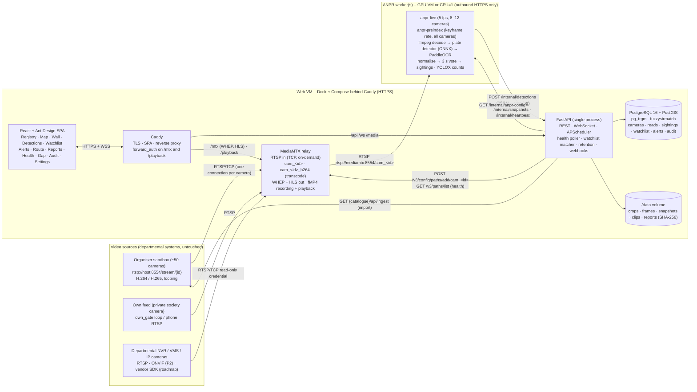
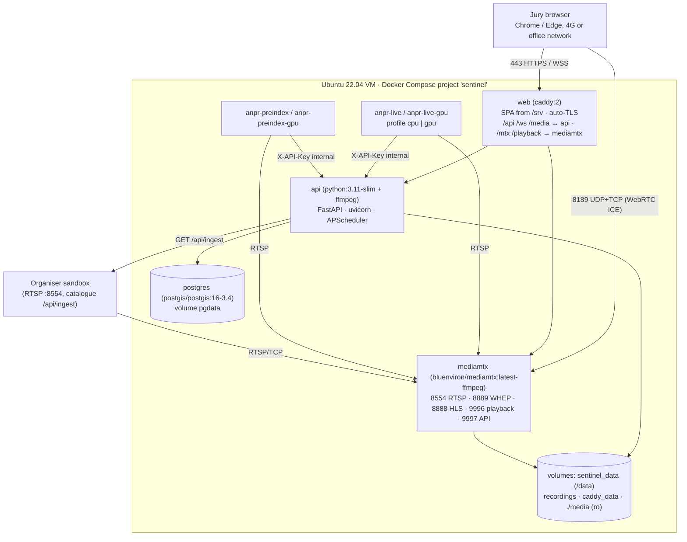
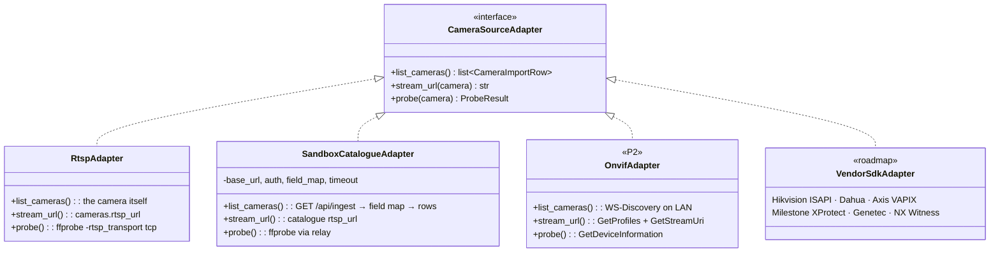
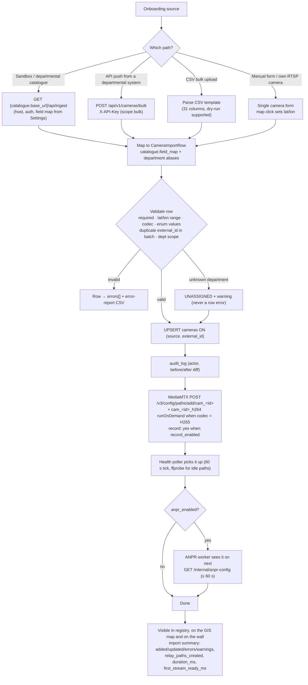
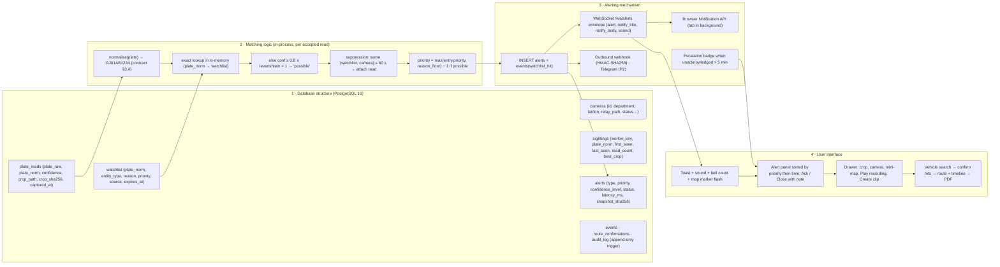
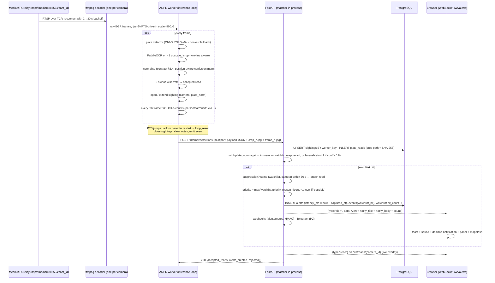
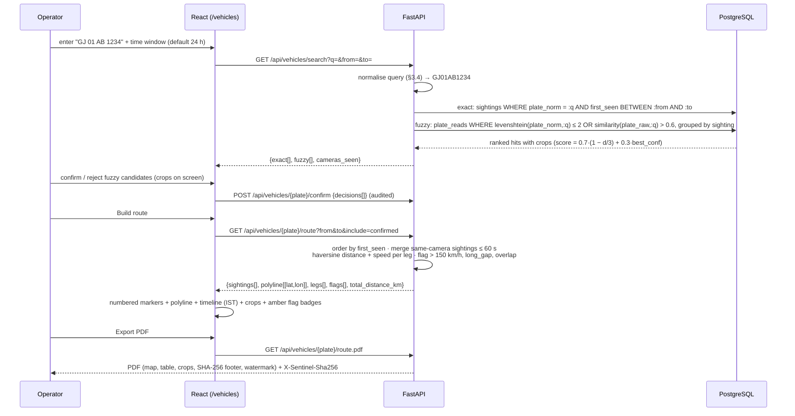

# Sentinel Gujarat — Technical Proposal / High-Level Design (HLD)

| | |
|---|---|
| **Programme** | Gujarat Police Innovation Challenge 2026 · CCTV Integration Hackathon ("Sentinel") · Phase 1 Sandbox Round |
| **Team** | Dynatech Consultancy · Category 2 (Company / Systems Integrator) |
| **Product** | **Sentinel Gujarat** · version `1.0.0-phase1` (git tag `v1.0-phase1`) |
| **Models** | **Model 1 (Centralised CCTV Registry & GIS) + Model 2 (Unified Viewing & Metadata Analytics)**, with a hybrid roadmap to Models 3 and 4 |
| **Hosted demo** | `[FILL: https://<demo-domain>]` — jury credentials are supplied in the portal submission form |
| **Repository** | `[FILL: GitHub URL]` (tag `v1.0-phase1`) |
| **Document status** | Near-final draft, 5 September 2026. Performance figures are from the CPU-only laptop integration run of 5 Sept (README "Measured on a 12-core laptop", `docs/acceptance-log.md`); GPU throughput is filled from the VM soak; items marked `[SCREENSHOT]` receive an image before PDF export |
| **Companion documents** | `SCALE-PLAN.md` (Plan for Scale, cost estimate, phased rollout) · `REGISTRY-API.md` (rendered OpenAPI) · `LICENCES.md` · `submission-checklist.md` |

All times in the product are stored in UTC and rendered in IST (`Asia/Kolkata`) as `dd MMM yyyy, HH:mm:ss IST`. Every runtime component is open source (see `LICENCES.md`); no cloud AI API is used anywhere.

---

## Table of contents

1. Problem understanding and chosen models
2. Solution overview, objectives and innovations
3. System architecture and component interactions
4. Integration approach for heterogeneous cameras, NVRs and VMS platforms
5. Live-stream ingestion and processing from dispersed locations
6. Model 1 — registry, GIS, health, gap analysis, RBAC, audit
7. CCTV-to-watchlist correlation and alert workflow (database structure · matching logic · alerting mechanism · user interface)
8. Video-analytics approach (ANPR and counting now; FRS, intrusion, tracking roadmap)
9. Alert generation, notification, prioritisation, visualisation and user workflows
10. Cross-camera vehicle movement history (route reconstruction)
11. Recording tier
12. Security architecture
13. Privacy, retention and evidence integrity
14. Scalability, interoperability and performance for ~80,000 cameras (summary)
15. Architecture principles (guide §7.5) → evidence
16. Integration-readiness matrix — VAHAN, SARTHI, eGujCop, AFIS, NAFIS
17. Existing departmental systems remain unaffected (Model 2 architecture note)
18. Phase 2 on-site operation
19. Technical prerequisites and information needed from departments
20. What is live in the demo versus roadmap
21. Appendices — data model, API surface, glossary

---

## 1. Problem understanding and chosen models

### 1.1 The problem as we read it

Twenty-six Government of Gujarat departments run their own CCTV estates: analog and IP cameras, DVRs, NVRs and VMS platforms from many vendors, retention between 7 and 15+ days, spread over roughly 1,000 km including remote and border districts (Valsad, Dahod, Gir Somnath, Jamnagar, Devbhumi Dwarka) where connectivity is often 4G. Gujarat Police (SCRB) needs **one interoperable platform** that:

1. knows where every camera is, who owns it, how it is connected and whether it is working (**registry + GIS + health**);
2. can show any camera live without disturbing the owning department (**unified viewing**);
3. reads number plates on those feeds, correlates them with watchlists and raises alerts in real time (**ANPR + correlation + alerts**);
4. can answer "where did vehicle GJ 01 AB 1234 go?" with a timestamped, location-wise movement history across cameras (**route reconstruction** — the Phase 2 live test);
5. has a credible, costed path to ~80,000 cameras and to the government databases (VAHAN, SARTHI, eGujCop, AFIS, NAFIS).

### 1.2 Chosen models and justification

| Model | Status in this submission | Why |
|---|---|---|
| **Model 1 – Centralised CCTV Registry & GIS Mapping** | **Delivered (mandatory)** | Bulk (catalogue and CSV), manual and API onboarding; GIS map with department / type / status / maintenance / coverage / district layers; health and maintenance-status monitoring; gap-analysis and ageing-infrastructure report; role-based search, filtering and export; append-only audit trail |
| **Model 2 – Unified Viewing & Metadata Analytics** | **Delivered** | Direct RTSP connection to each source through an internal relay (no federation middleware — FAQ Q17); video wall 4/9/16; ANPR metadata generation; event tagging; searchable vehicle-movement records; alerts on watchlisted vehicles; departmental systems stay untouched (§17) |
| Model 3 – VMS Federation & Middleware | **Roadmap, seeded in code** | The `CameraSourceAdapter` interface (RTSP and sandbox-catalogue implementations today; ONVIF designed as P2 in §4.2, not yet implemented) and the outbound webhook are the visible seed of the adapter framework and event bus; Kafka-based federation is described in the Plan for Scale |
| Model 4 – Central VMS & AI Platform | **Roadmap, partially delivered** | Short-retention event recording, playback and evidence clips are delivered; hot/warm/cold central recording, Kubernetes and DR are designed and costed in the Plan for Scale |
| Model 5 – Hybrid | The submission is the hybrid **"Model 1 + Model 2 (hybrid roadmap to 3/4)"** and is described identically in every document | |

The choice is deliberate: every mandatory functional item of the challenge (registry, GIS, onboarding of sandbox feeds, ANPR, watchlist, real-time alert, movement history, output report) lives in Models 1 and 2 and can be shown working on the organiser's raw RTSP feeds. Models 3 and 4 cannot be demonstrated truthfully on raw RTSP loops in the Phase 1 window; we show their path in code and in the design rather than claim them.

---

## 2. Solution overview, objectives and innovations

### 2.1 One-line description

A web platform on which Gujarat Police can **register every camera on a map, watch any of them live, read number plates automatically, be alerted when a watchlisted vehicle appears, and trace where that vehicle went** — running on the organiser's sandbox feeds plus our own private-camera feed.

### 2.2 Objectives (what "done" means)

| # | Objective | Evidence in the demo |
|---|---|---|
| O1 | Onboard the ~50 sandbox cameras in one click and measure the time | Import summary "50 fetched · 50 added · 8 ANPR-enabled · onboarded in N s · first stream ready in M ms" |
| O2 | Show feeds from at least two different systems in one viewer | Wall with sandbox cameras and the own private-society camera side by side; "Two systems" badge |
| O3 | Read plates with confidence and timestamps, store crops with hashes | Detections page, live-reads overlay, SHA-256 per crop |
| O4 | Alert within seconds of a watchlisted plate being read | Toast + sound + desktop notification + panel; `latency_ms` on every alert |
| O5 | Reconstruct a vehicle's route across cameras with operator confirmation | Route page: numbered markers, polyline, timeline, crops, PDF |
| O6 | Produce an evidence-grade output report | CSV + PDF with IST timestamps, camera IDs, SHA-256, object-count summary, quality section |
| O7 | Scope every view by role and department, and audit every action | Four seed roles; `dept_admin_police` sees only Police cameras; append-only audit log |
| O8 | Be deployable on a fresh VM in under 15 minutes and on a CPU-only laptop | `deploy.sh`; `COMPOSE_PROFILES=cpu` |

### 2.3 Innovations and operational value

| Innovation | Why it matters for policing |
|---|---|
| **One connection per camera, relay-centric design** — MediaMTX pulls each source once over TCP; browsers, ANPR workers and recording all read the relay | Departmental NVRs never see more than one client; 4G cameras are not overloaded; the department's own viewing is unaffected |
| **Settings-driven catalogue onboarding with a field map** — host, credentials and JSON field mapping editable in the UI; `POST /settings/catalogue/test` reports unmapped fields | A new environment (Phase 2 venue, a department's NVR export) is onboarded in minutes without a code change; onboarding time is measured and shown |
| **Position-aware plate normalisation with char-wise voting** — a fully specified algorithm shared by the worker and the API with 20 test vectors | Indian formats (standard and BH series), two-line plates, OCR confusions (0/O, 1/I, 5/S, 8/B) are handled deterministically; search and alerts agree with each other |
| **Pre-index + live dual mode** — all cameras indexed at keyframe rate, road-facing cameras at 5 fps | The Phase 2 plate is in the database before the test starts; live reads still arrive within seconds |
| **Operator-in-the-loop route building** — fuzzy candidates are shown with crops and confirmed or rejected; decisions are audited | Movement history is defensible in court: every inclusion is a human decision with evidence attached |
| **Evidence integrity by construction** — SHA-256 on every crop, frame, clip and report at write time; hash-and-watermark footer; `GET /evidence/verify` | Chain of custody for NFSU-grade forensic use |
| **Recorded evidence next to metadata** — "Play recording" from any alert or sighting; 30 s evidence clip with hash | The operator sees the vehicle, not only the plate string |
| **Privacy controls** — retention job, purpose-limitation notice, export watermarking, data scoping in SQL | Meets the auditability and privacy bonus items and reduces legal exposure |
| **Open source end-to-end** — no proprietary VMS, SDK or cloud AI; licences listed | Statewide deployment without per-camera licence fees; vendor neutrality |

---

## 3. System architecture and component interactions

### 3.1 Architecture diagram

Source: `docs/diagrams/01-architecture.mmd`.



ASCII rendering for readers without Mermaid:

```
[Sandbox cams] --RTSP/TCP--> [MediaMTX relay] --WHEP/HLS--> [React UI: wall, camera view]
[Own camera]   --RTSP------>       |  (libx264 / NVENC transcode of H.265 for browser paths; fMP4 recording)
                                   +--RTSP--> [ANPR worker] --POST detections+crops--> [FastAPI]
                                                                                          |  matcher + WS fan-out in-process
                                                                                          v
[Catalogue /api/ingest] --import--> [FastAPI] <--> [PostgreSQL: cameras, reads, sightings, watchlist, alerts, events, audit]
[FastAPI health poller] --/v3/paths/list + ffprobe--> [MediaMTX]     [React UI: registry, map, route, reports, audit]
```

### 3.2 Components

| Component | Technology | Responsibility | Interfaces |
|---|---|---|---|
| **Web / edge proxy** | Caddy 2 | TLS termination (auto Let's Encrypt), static SPA, reverse proxy, `forward_auth` to `GET /api/auth/verify` for media paths, security headers, gzip/zstd | `/api/*`, `/ws/*`, `/media/*` → API; `/mtx/*`, `/playback/*` → MediaMTX |
| **API** | Python 3.11, FastAPI, SQLAlchemy 2 (async), Pydantic v2, APScheduler, python-jose, passlib/bcrypt | REST + WebSocket; importers (catalogue, CSV, bulk API, manual); MediaMTX control; health poller; watchlist matcher; route builder; report builder (pandas + reportlab); retention job; webhooks; audit middleware; mock sandbox catalogue | OpenAPI at `/api/docs`; `/ws/alerts`, `/ws/reads/{id}`, `/ws/health`; `/internal/*` for workers |
| **Relay** | MediaMTX (ffmpeg build) | Pull each RTSP source once over TCP, on demand; expose WHEP (WebRTC) and HLS; transcode H.265 → H.264 for browsers (`libx264`, or `h264_nvenc` on the GPU VM); record fMP4 segments with 12 h rolling retention; playback server | Control API `:9997` (`/v3/config/paths/*`, `/v3/paths/*`); RTSP `:8554`; WHEP `:8889`; HLS `:8888`; playback `:9996`; ICE mux `:8189` |
| **ANPR worker** | Python 3.11, ffmpeg, onnxruntime, PaddleOCR (PP-OCRv4), OpenCV, YOLOX-s (ONNX) | Decode, detect, OCR, normalise, vote, sightings, object counts, snapshots, loop-reset detection; posts everything to the API; two modes (`live`, `preindex`); `CPU=1` path for any laptop | Reads `GET /internal/anpr-config`; posts `/internal/detections`, `/internal/snapshots`, `/internal/heartbeat`, `/internal/events` |
| **Database** | PostgreSQL 16 with PostGIS, `pg_trgm`, `fuzzystrmatch` | Single datastore; geography column on cameras for `ST_DWithin`/`ST_Buffer`; trigram indexes for fuzzy plate search; append-only audit trigger | `create_all` at startup; idempotent seed |
| **File store** | Docker volume `/data` | Crops, frames, snapshots, clips, reports, exports; content-addressed, SHA-256 computed on write | Served by the API at `/media/*` with auth and scoping |
| **Frontend** | React 18, TypeScript, Vite, Ant Design 5, TanStack Query, react-leaflet + markercluster, hls.js, recharts | 19 routes (login, dashboard, registry, import, camera page, map, wall, detections, vehicles, route, watchlist, alerts, events, reports, health, gap analysis, audit, settings, about) | Same-origin `/api`, `/ws`, `/mtx`, `/playback`, `/media` |

### 3.3 Component interactions (runtime)

| Interaction | Direction | Protocol / contract | Notes |
|---|---|---|---|
| Catalogue import | API → catalogue host | `GET {catalogue.base_url}/api/ingest`; auth none/basic/bearer/header | Field-mapped; unknown departments → `UNASSIGNED` with a warning |
| Relay path management | API → MediaMTX | `POST /v3/config/paths/add/cam_<id>` (+ `cam_<id>_h264` for H.265); `PATCH`/`DELETE` on change/retire | Re-added on API start and whenever the poller finds a path missing (MediaMTX runtime paths are not persisted) |
| Health | API → MediaMTX | `GET /v3/paths/list`, `GET /v3/config/paths/list`; `ffprobe` for idle on-demand paths | 60 s tick; 3 consecutive not-ready → offline |
| Worker configuration | Worker → API | `GET /internal/anpr-config?mode=live|preindex` every 60 s | Cameras appear/disappear without restarting the worker |
| Detections | Worker → API | `POST /internal/detections` multipart (payload JSON + crops + frames), one camera per batch, every 1 s | Idempotent sightings by `worker_key`; API re-normalises and re-hashes |
| Alerts | API → browsers | WebSocket envelope `{type, ts, data}`; `alert`, `alert_update`, `stats` | Scoped per user; server-rendered `notify_title`/`notify_body` |
| Live video | Browser → relay | WHEP (5 s ICE timeout) → hls.js → snapshot | Through Caddy with `forward_auth`; cookie set at login |
| Recording | Browser → relay | `/playback/list`, `/playback/get?format=mp4` via API-resolved URLs | Evidence clips are downloaded by the API, hashed and stored |
| Outbound integration | API → department systems | Webhook `POST` with HMAC-SHA256 signature; retries 2/4/8 s | Event types `alert.created`, `alert.updated`, `camera.offline`, `camera.online`, `event.created` |

### 3.4 Deployment view (Phase 1)

Source: `docs/diagrams/10-deployment.mmd`.



One Ubuntu 22.04 VM (T4-class GPU, 8 vCPU, 32 GB RAM, 400 GB SSD) runs the whole Compose project. Published ports: 80/443 TCP (Caddy) and 8189 UDP+TCP (WebRTC ICE); the relay's own ports are bound to loopback only. Images are pinned by digest (MediaMTX v1.20.1, `postgis/postgis:16-3.4`). The `cpu` profile runs the same stack on a laptop with no GPU (software decode, ONNX CPU provider, `libx264` transcode); `deploy.sh --gpu` adds `deploy/docker-compose.gpu.yml`, which swaps in the CUDA worker images, rebuilds the relay from `deploy/mediamtx-nvidia.Dockerfile` (the same MediaMTX binary on an NVENC-capable ffmpeg) and forces `MEDIAMTX_TRANSCODE=nvenc`. Because the ANPR worker only needs outbound HTTPS to the API, it can also run on a separate GPU host (office RTX PC, rented GPU pod) without any inbound port.

---

## 4. Integration approach for heterogeneous cameras, NVRs and VMS platforms

### 4.1 Design position

The platform treats every source as **"something that yields an RTSP URL plus metadata"**. Everything downstream (relay, viewing, ANPR, recording, health) works on that URL. Heterogeneity is absorbed at the edge by small **adapters**, never by the core. This is the seed of Model 3's adapter framework, delivered in code today.

### 4.2 The `CameraSourceAdapter` framework

Source: `docs/diagrams/08-adapter-framework.mmd`.



| Adapter | Status | What it does | Typical departmental system |
|---|---|---|---|
| `RtspAdapter` | **Live** | Any RTSP/RTSPS URL typed in the manual form or imported by CSV/API; credentials allowed in the URL (masked for non-admins) | IP cameras, NVR/DVR channel URLs (`rtsp://nvr/Streaming/Channels/101`, `rtsp://dvr/cam/realmonitor?channel=1&subtype=0`), encoders in front of analog cameras |
| `SandboxCatalogueAdapter` | **Live** | Pulls a JSON catalogue (`/api/ingest` shape), unwraps wrapper objects (`cameras`, `data`, `items`, `results`, `streams`), maps fields through an editable ordered candidate list (`catalogue.field_map`), normalises codec / resolution / live flags, maps department display names through aliases | The organiser sandbox; any VMS or NVR that can export a camera list as JSON; a departmental asset register |
| `OnvifAdapter` | P2 (2 h time-box, after all P0/P1) | WS-Discovery on the LAN, `GetProfiles`, `GetStreamUri` via `onvif-zeep`; onboarding by IP + credentials | ONVIF Profile S/T cameras of any vendor |
| Vendor SDK adapters | Roadmap | Thin adapters returning RTSP/RTSPS URLs and metadata from vendor APIs: Hikvision ISAPI, Dahua HTTP API, Axis VAPIX, Milestone XProtect (MIP SDK / REST), Genetec Security Center SDK, Nx Witness REST | Departmental VMS platforms |

Every adapter produces the same `CameraImportRow` (external_id, name, department, type, ownership, lat/lon, address, district, police station, RTSP URL, codec, resolution, fps, storage, retention, install date, vendor, model, heading, FoV, connectivity, bandwidth, VMS platform, NVR id, maintenance, AMC) and goes through the **same validation and upsert** (`UNIQUE (source, external_id)`), the same audit row and the same relay-path creation. Onboarding is therefore identical whether a camera arrived from the sandbox catalogue, a CSV, the bulk API or a form.

### 4.3 The bulk onboarding API (Model 1 "API-based onboarding")

`POST /api/v1/cameras/bulk` — header `X-API-Key: sk_…` (scope `bulk`), body `{"cameras": [CameraImportRow, …]}` (≤ 1,000 per call). Per-row results (`added` / `updated` / `error` with `index`, `field`, `message`), warnings for unknown departments, `duration_ms`. Documented live at `/api/docs` and rendered to `REGISTRY-API.md`. A departmental system pushes its inventory on a schedule; re-pushing is an idempotent upsert.

### 4.4 Codec, resolution and analog handling

| Situation | Handling |
|---|---|
| H.264 | Relayed as-is (`cam_<id>`); WebRTC and HLS play natively |
| H.265 / HEVC | Relayed as-is for ANPR (the worker decodes HEVC); a second on-demand path `cam_<id>_h264` transcodes with `libx264` (CPU) or `h264_nvenc` (GPU VM) for browsers and recording, so playback works on laptops without hardware HEVC |
| MJPEG | Relayed; HLS/WebRTC via ffmpeg remux path (roadmap: automatic) |
| Analog cameras | Onboarded through the DVR/encoder RTSP channel; registered as `type=analog` so the gap report flags them for IP replacement |
| Sub-streams | `rtsp_url` may point at the camera's sub-stream (D1/CIF) for low-bandwidth links; ANPR quality is then limited and the camera is flagged in the quality report |
| Mixed resolutions and frame rates | Worker scales to 960 px wide and drives frame timing from PTS (`fps=` filter); nothing assumes 25 fps |

### 4.5 Two systems in one viewer (Model 2 expected deliverable)

The video wall shows the **organiser sandbox** (source `sandbox`) and our **own private-society camera** (source `own`, `ownership=private`, external id `OWN-GATE-01`) side by side, with a "Two systems" badge; an ONVIF LAN camera (S8) would make three. The own camera is presented as the "private / public-facing CCTV onboarding" bonus item: a society gate camera onboarded by RTSP with a read-only credential.

---

## 5. Live-stream ingestion and processing from dispersed locations

### 5.1 Ingestion rules (organiser integration rules, applied everywhere)

| Rule | Where it is enforced |
|---|---|
| RTSP over TCP | MediaMTX `rtspTransport: tcp` on every path; ffmpeg `-rtsp_transport tcp` in the worker and in health probes |
| Timing from PTS, not arrival time | The worker's `fps=` filter is PTS-driven; `stream_pts` is stored with every read; wall-clock `captured_at` is recorded alongside |
| Reconnect with exponential backoff 2–30 s | MediaMTX source reconnect; worker decoder restart `RECONNECT_MIN_S`=2 → `RECONNECT_MAX_S`=30; API-to-worker HTTP retries 2→30 s |
| Tolerate loop discontinuities | `stream_pts < last_pts − 1.0` or a decoder restart → `loop_reset`: close open sightings, clear vote buffers, emit an event; a loop yields a second, truthful sighting |
| One connection per source | Only the relay pulls from the source; browsers, ANPR, recording and health all read the relay |

### 5.2 Why a relay, and why on demand

- **Dispersed sources, one control point.** MediaMTX pulls from any RTSP host reachable from the VM (sandbox, departmental NVR, 4G camera). Sources are pulled **on demand** and closed after 60 s idle, so an 80,000-camera registry does not mean 80,000 permanent pulls; ANPR-enabled cameras keep their pull alive by being read continuously.
- **Browser reality.** The sandbox's own WHEP/HLS endpoints are plain HTTP on another origin; embedding them in an HTTPS UI would break on mixed content, CORS and one-connection-per-viewer. The relay serves WHEP and HLS from our origin behind authentication.
- **Health.** MediaMTX exposes `ready`, `tracks`, `bytesReceived` and `readers` per path; idle on-demand paths report `ready=false`, so the poller actively `ffprobe`s up to 20 not-ready cameras per tick (4 in parallel) and never probes cameras the catalogue marks `live=false`.
- **Self-healing.** Runtime-added MediaMTX paths are not persisted; the API re-adds every non-retired camera's path on start-up and whenever the poller finds one missing.

### 5.3 Processing placement

Phase 1 runs the relay and the workers on one VM. At scale (§14 and the Plan for Scale) the same containers run **per district**: a regional relay cluster pulls the district's cameras, edge ANPR appliances read the local relay, and only **metadata and the best crop per sighting (~2 KB/s per camera)** travel to the state data centre. Video never crosses the state backbone unless recording is centralised (Model 4 option). Low-bandwidth sites (4G) use keyframe-only pulls, sub-streams or snapshot mode, and the edge appliance queues detections locally (store-and-forward) when the uplink drops.

### 5.4 Browser playback sequence

`StreamPlayer`: `GET /api/streams/{id}` → **WHEP** (WebRTC, `POST /mtx/<path>/whep`, 5 s ICE timeout, ICE over UDP or TCP on 8189) → **hls.js** (`/mtx/<path>/index.m3u8`, low-latency, 10 s manifest timeout) → **snapshot mode** (`/media/snapshots/cam_<id>.jpg`, refreshed every second from the worker). The 16-tile wall shows 4 live tiles plus 12 one-second snapshots so that a jury laptop is not asked to decode sixteen 1080p streams.

---

## 6. Model 1 — registry, GIS, health, gap analysis, RBAC, audit

### 6.1 Onboarding flow

Source: `docs/diagrams/02-onboarding.mmd`.



### 6.2 Registry metadata (portal Model 1 list)

Location (lat/lon, address, district, police station, ward), department (26 seeded departments plus `UNASSIGNED`), **type** (analog / IP / PTZ / dome / bullet / ANPR / other), **ownership** (govt dept / private / public-facing), **connectivity** (LAN / fibre / 4G / 5G / leased line / Wi-Fi + bandwidth kbps), **storage** (NVR/DVR/VMS platform, NVR id, storage location, retention days), install date, vendor, model, heading and FoV, **maintenance status** (ok / under maintenance / faulty / decommissioned), last maintenance, AMC vendor and expiry. Role-based search, filtering, sort and **CSV export** (watermarked, hashed, audited) — the export doubles as the "sample onboarded camera-metadata dataset" deliverable.

### 6.3 GIS map

Leaflet with layer groups: **department** (one layer per code, fixed palette), **camera type**, **status** (online / degraded / offline / unknown), **maintenance**, **district boundaries** (33 districts GeoJSON), **POIs**, **coverage circles** (`ST_Union(ST_Buffer(geog, radius))`), **zero-coverage cells** (from the gap analysis) and coverage cones from heading/FoV (P2). Marker clustering above 50 markers; popup with "View live" and "Details"; alert flash on the camera marker.

### 6.4 Health and maintenance-status monitoring

Source: `docs/diagrams/05-health-loop.mmd`.

```mermaid
flowchart LR
  T["APScheduler tick<br/>every HEALTH_POLL_SECONDS (60 s)"] --> A["GET mediamtx /v3/paths/list<br/>ready · tracks · bytesReceived · readers"]
  T --> A2["GET /v3/config/paths/list<br/>missing path → re-create (self-healing)"]
  T --> B["Catalogue live flag<br/>(from last import)"]
  A --> C{"ready?"}
  C -- "no, live≠false, has rtsp_url" --> PR["Active ffprobe over TCP<br/>≤ 20 idle cameras per tick, 4 in parallel"]
  C -- "yes" --> S
  PR --> S["camera_health_log row per camera<br/>is_ready · has_video · bytes_delta · source_flag"]
  B -- "live=false → not probed, source_flag=catalogue" --> S
  S --> U{"State machine"}
  U -- "ready ∧ video ∧ (bytes↑ ∨ probe)" --> ON["online · last_seen_at · fail_count=0"]
  U -- "ready ∧ (no video ∨ bytes=0)" --> DG["degraded"]
  U -- "not ready × 3 consecutive" --> OFF["offline · alert(camera_offline, low)<br/>event(camera_offline)"]
  OFF -- "returns" --> AC["auto-close alert · event(camera_online)"]
  ON --> W["WS /ws/health: health (on change) · stats (every 10 s)"]
  DG --> W
  OFF --> W
  AC --> W
  W --> D["Dashboard tiles · health page · map marker colour"]
```



Outputs: per-camera uptime % over 24 h, last seen, status transitions, "down > 5 min" list, **AMC expiring in 30 days** list, maintenance list, disk usage, MediaMTX and ANPR-worker status (heartbeats every 15 s). Cameras under maintenance or decommissioned are checked but never raise offline alerts.

### 6.5 Gap analysis and ageing infrastructure

Computed on request and cached 5 minutes; parameters (coverage radius 150 m, POI radius 300 m, grid 500 m, ageing threshold 5 years) editable:

1. Coverage by district / police station / ward with per-department counts and online %.
2. Coverage circles as a GeoJSON layer.
3. Zero-coverage grid cells (`ST_SquareGrid` in EPSG:3857, clipped to the district, no intersecting coverage circle).
4. Uncovered POIs (`ST_DWithin` false for every camera).
5. Department × district gaps.
6. Offline hotspots (clustered by police station).
7. Metadata gaps (missing stream URL, retention, install date, department).
8. **Ageing infrastructure**: cameras older than N years, expired or expiring AMC, analog cameras due for IP replacement, cameras faulty or under maintenance for > 7 days; replacement-priority score `min(100, 10·age_over + 30·analog + 25·amc_expired + 15·amc_expiring + 0.2·offline_pct + 10·near_poi)`.
9. Templated recommendations per district.

Exported as one sectioned CSV and a PDF with a static map — the "sample gap-analysis report" deliverable.

### 6.6 RBAC with data scoping

| Role | Scope | Can |
|---|---|---|
| `admin` | statewide | everything, including users, API keys, settings, audit, catalogue import |
| `dept_admin` | own department (+ optional district), **applied in SQL** to cameras and every camera-derived resource (health, reads, sightings, alerts, events, counts, recordings, clips, streams, dashboards, gap analysis, reports, WebSocket broadcasts) | camera CRUD and CSV import within scope; watchlist (statewide by design); ack alerts; confirm routes; export |
| `operator` | statewide | watchlist, alerts, route confirmation, events, reports, external lookup; no camera edits |
| `viewer` | statewide | read-only |

Permissions (`cameras.read`, `cameras.write`, `cameras.export`, `analytics.read`, `watchlist.write`, `alerts.ack`, `route.confirm`, `events.write`, `reports.export`, `external.lookup`, `zones.write`, `admin.*`) are returned by `GET /auth/me`, so the UI hides actions without hard-coding the matrix. A scoped miss returns `404`, never leaking existence. Seed jury accounts: `jury_admin`, `jury_operator`, `jury_viewer`, plus `dept_admin_police` to demonstrate scoping.

### 6.7 Audit trail

Middleware writes one `audit_log` row for every mutating request and for sensitive reads (stream view, recording play, vehicle search and route, exports, report downloads, evidence verification, external lookups) with actor, role, action, entity, before/after JSON, IP (first `X-Forwarded-For` hop), user agent and request id. The table is **append-only**: a `BEFORE UPDATE OR DELETE` trigger raises `audit_log is append-only`. System jobs (poller, retention) write rows with `actor='system'`; API-key calls write `actor='apikey:<name>'`. The audit page filters by user, action prefix, entity and time and exports CSV.

---

## 7. CCTV-to-watchlist correlation and alert workflow

The portal requires the **complete integration workflow — database structure, matching logic, alerting mechanism and user interface** — shown together. Source: `docs/diagrams/06-integration-workflow.mmd`.



### 7.1 Database structure

| Table | Purpose | Key columns |
|---|---|---|
| `watchlist` | Entities of interest — vehicles (plate) and persons (FRS-era, readiness only) | `entity_type`, `plate_norm` (unique among active vehicles), `name`, `reason` (stolen / wanted / blacklisted / missing / suspect / arrested / unidentified_body / other), `priority` (critical / high / medium / low), `source` (own / egujcop / vahan / manual / import), `expires_at`, `is_active`, `hit_count`, `last_hit_at` |
| `plate_reads` | Every accepted (voted) read | `camera_id`, `captured_at` (UTC), `stream_pts`, `plate_raw`, `plate_norm`, `is_valid_format`, `confidence`, `bbox`, `crop_path`, `crop_sha256`, `mode` |
| `sightings` | A vehicle's continuous presence at one camera | `worker_key` (idempotent), `camera_id`, `plate_norm`, `first_seen`, `last_seen`, `read_count`, `best_conf`, `best_crop_path`, `frame_path`, `frame_sha256`, `closed` |
| `alerts` | Correlation results and camera-offline / intrusion alerts | `type`, `status` (new / acknowledged / closed), `priority`, `confidence_level` (exact / possible), `camera_id`, `watchlist_id`, `sighting_id`, `read_id`, `plate_norm` (denormalised), `snapshot_path` + `snapshot_sha256`, `read_count`, `latency_ms`, `acknowledged_by/at`, `closed_by/at`, `outcome`, `note` |
| `events` | Manual tags (accident / suspicious / checkpoint / other) and automatic ones (watchlist_hit, loop_reset, intrusion, camera_offline/online) | `camera_id`, `occurred_at`, `type`, `note`, links to sighting / read / alert, `is_auto` |
| `route_confirmations` | Operator decisions on fuzzy candidates | `query_plate`, `sighting_id`, `decision`, `user_id` |
| `audit_log` | Append-only trail | `actor`, `role`, `action`, `entity`, `before`, `after`, `ip` |

Indexes: `plate_reads(plate_norm, captured_at)`, trigram GIN on `plate_raw` and `plate_norm`, `sightings(plate_norm, first_seen)`, `sightings(camera_id, first_seen)`, `alerts(status, created_at)`, `alerts(watchlist_id, camera_id, created_at)`. Full definitions: Appendix A.

### 7.2 Matching logic

1. **Normalise** the read (`contract §3.4`): uppercase, strip non-alphanumerics and the `IND` prefix; position-aware confusion maps (`0→O 1→I 5→S 8→B 2→Z 6→G` in letter slots, `O→0 I→1 S→5 B→8 Z→2 G→6 Q→0 D→0` in digit slots); try the standard pattern `^[A-Z]{2}[0-9]{1,2}[A-Z]{1,3}[0-9]{4}$` with a two-digit then one-digit district split (district `0` does not exist), then the BH pattern `^[0-9]{2}BH[0-9]{4}[A-Z]{1,2}$`; accept at most two substitutions. Twenty shared test vectors pin the behaviour in both the worker and the API.
2. **Exact match**: `plate_norm` looked up in an in-memory map of effective vehicle watchlist rows (rebuilt on every watchlist change and every 60 s). Hit → `confidence_level='exact'`.
3. **Possible match**: if `read.confidence ≥ alerts.fuzzy_min_conf` (0.8) and some key has Levenshtein distance 1 → `confidence_level='possible'` (first key in priority order).
4. **Suppression**: an alert for the same `(watchlist_id, camera_id)` created within `alerts.suppression_s` (60 s), or still open and created within 10 min, absorbs the read (`read_count += 1`, `last_read_at`, upgrade to `exact` if the new read is exact) and emits `alert_update` instead of a new alert.
5. **Priority** (feature W6): `reason_floor = {stolen: critical, wanted: critical, blacklisted: high, arrested: high, missing: medium, unidentified_body: medium, suspect: low, other: low}`; `effective = max(watchlist.priority, reason_floor)`; a `possible` match steps down one level.
6. Only valid-format plates are alertable; invalid strings remain searchable.

### 7.3 Alerting mechanism

- `INSERT alerts` with `latency_ms = created_at − read.captured_at`; `INSERT events(type='watchlist_hit')`; `watchlist.hit_count++`.
- **WebSocket** `/ws/alerts`: envelope `{type:"alert", ts, data: Alert + sound + notify_title + notify_body}`; scoped to the user's department; clients ping every 25 s and reconnect with 1→15 s backoff, re-fetching `GET /alerts` to fill gaps.
- **Browser desktop notification** (Web Notifications API) when the tab is hidden; click focuses the alert.
- **Outbound webhook** `POST` with `X-Sentinel-Signature: sha256=<HMAC>` to any departmental endpoint (eGujCop dispatch, a control-room bus); retries 2/4/8 s; delivery log.
- **Telegram** message with crop for priority ≥ `notify.telegram_min_priority` (P2, one HTTP call, disabled unless a token is configured).
- **Camera-offline** and **intrusion** alerts share the same channel and lifecycle.

### 7.4 User interface

Toast (priority-coloured; critical persists) + sound + bell badge + map marker flash + red dot on the sidebar; alert panel sorted by priority then time with an **escalation badge** when unacknowledged for > 5 min; Ack / Close with note and outcome (`resolved`, `false_positive`, `duplicate`, `other`); detail drawer with crop, full frame, camera card, mini-map, "Play recording" (from 10 s before the read) and "Create clip"; one click to the vehicle's route. `[SCREENSHOT: alert toast + panel]`

---

## 8. Video-analytics approach

### 8.1 ANPR pipeline (delivered)

Source: `docs/diagrams/03-anpr-alert-sequence.mmd`.



| Stage | Detail | Model / licence |
|---|---|---|
| Decode | `ffmpeg -rtsp_transport tcp [-hwaccel cuda] -i rtsp://mediamtx:8554/cam_<id> -vf fps=5,scale=960:-1 -f rawvideo -pix_fmt bgr24 -`; frames dropped (never queued) when inference lags; `-skip_frame nokey` at ~1 fps in pre-index mode | ffmpeg (LGPL/GPL build) |
| Plate detection | YOLO-v9-t-384 licence-plate detector (ONNX) on the full 960 px frame, conf ≥ 0.4, boxes < 60 px wide skipped; **contour fallback** (bright quadrilaterals, aspect 0.15–0.6, fill ≥ 0.6) used when ONNX returns no box — this reads the synthetic plates on the CPU-only laptop and is a weak fallback on real feeds; the active detector is reported in every heartbeat | open-image-models detector; onnxruntime (MIT) |
| OCR | Crop upscaled ×3, grayscale + CLAHE; PaddleOCR PP-OCRv4 (det + rec) so **two-line plates** yield two lines joined before normalisation | PaddleOCR / PaddlePaddle (Apache-2.0) |
| Normalise | Contract §3.4 (above) | shared pure function |
| Vote | Per (camera, plate bucket) reads kept for 3 s; char-wise majority string with mean confidence; crop of the best member — the single largest accuracy gain | |
| Sightings | Opened on the first accepted read, extended while reads arrive, closed after 15 s silence; `best_*` track the best read; a loop pass creates a new sighting (truthful) | |
| Persist | One multipart batch per camera per second; the API re-normalises, writes files with SHA-256, upserts sightings idempotently by `worker_key` | |
| Modes | `live` (8–12 cameras, 5 fps, snapshots, object counts) and `preindex` (every camera, keyframe rate, no snapshots/counts) as separate containers; `ANPR_CAMERAS` splits cameras across hosts | |
| Throughput (T4) | Detector ≈ 5 ms/frame, OCR 20–40 ms/crop on CPU; NVDEC decode is the bottleneck: 10–12 cameras at 5 fps comfortable, 30–40 at keyframe rate; CPU-only 8 cores ≈ 3–4 cameras at 2–3 fps | Measured CPU-only (12-thread i5-1345U, 5 Sept 2026): 8 cameras decoded at 5 fps each, 19–21 frames/s inferred (≈ 2.5 fps per camera effective) on 2.7 cores, PaddleOCR 270–470 ms/crop, 2.0–2.3 GB RSS. Cameras per T4 at 5 fps / keyframe rate: from the VM soak (no GPU on the integration laptop) |

### 8.2 Vehicle / person detection and counting (delivered)

YOLOX-s COCO (ONNX, Apache-2.0) on every 5th live frame; classes person, bicycle, car, motorcycle, bus, truck (conf ≥ 0.35); a centroid tracker (IoU ≥ 0.3) counts each track once per minute per class; counts aggregated per (camera, minute, class), shown live on the camera page, charted per hour on the dashboard and totalled in the output report. `OBJECT_DETECT=0` disables it instantly.

### 8.3 Accuracy evidence (delivered)

`GET /reports/quality`: reads, valid-format %, sightings, unique plates, mean confidence, per-camera figures, and a **spot-check accuracy** from operator labels (`qa_labels`, 30 random crops per chosen camera) with exact-match %, character accuracy and a confusion table. Printed as a section of the output report PDF. Target: ≥ 80 % exact on chosen daytime cameras `[MEASURE]`.

### 8.4 Roadmap analytics

| Capability | Status | Design |
|---|---|---|
| Intrusion / restricted-zone alert (A7) | P2 (table, endpoints and worker hook exist; UI polygon editor time-boxed) | Admin draws a polygon on a snapshot with active hours and classes; a track centroid inside the zone for ≥ 2 s raises `alert(type='intrusion')` with the frame, suppressed 120 s per zone |
| Face recognition on watchlisted persons (F1) | Roadmap (only if every P0/P1 is green) | InsightFace `buffalo_s` on the own feed; watchlist person photos; alert type `frs_hit` (reserved in the schema); AFIS/NAFIS readiness — see §16. Note: InsightFace model weights are research-licensed; a production FRS needs a commercially licensed or self-trained model |
| Person / vehicle tracking across cameras | Delivered for vehicles via plate sightings (§10); appearance-based re-identification for persons is roadmap | Re-ID embeddings stored per sighting; cosine search within a time-space window |
| Crowd density, anomaly detection | Roadmap | Density heat-maps from the person counts already produced; anomaly = statistical deviation from the per-camera hourly baseline |
| Helmet / triple-riding / wrong-way | Roadmap | Same frame pipeline, additional ONNX heads; alerts through the same channel |

---

## 9. Alert generation, notification, prioritisation, visualisation and user workflows

### 9.1 Alert lifecycle

Source: `docs/diagrams/09-alert-lifecycle.mmd`.

```mermaid
stateDiagram-v2
  [*] --> new : matcher creates alert (exact / possible) or poller (camera_offline)
  new --> new : suppression attaches read (read_count++, alert_update)
  new --> acknowledged : POST /alerts/{id}/ack {note}  (operator / dept_admin / admin)
  new --> closed : POST /alerts/{id}/close {outcome, note} (sets acknowledged_* too)
  acknowledged --> closed : POST /alerts/{id}/close {outcome}
  new --> closed : auto-close (camera_offline when camera returns; outcome=resolved)
  closed --> [*]
  note right of new
    escalated = status is new AND age > alerts.escalate_minutes (5 min)
    priority = max(watchlist.priority, reason_floor), one step lower for 'possible'
    every transition is audited (alert.ack / alert.close / alert.auto_close)
  end note
```



### 9.2 Prioritisation rules (W6)

| Reason | Floor | Example |
|---|---|---|
| stolen, wanted | critical | Stolen Swift FIR 123/2026 → critical even if the entry says medium |
| blacklisted, arrested | high | RTO blacklist |
| missing, unidentified_body | medium | Missing person's vehicle |
| suspect, other | low | Pattern watch |

Effective priority = `max(entry priority, floor)`; a **possible** (Levenshtein 1) match is one level lower. `camera_offline` is always low; intrusion takes the zone's priority. The alert panel sorts by priority then time; unacknowledged alerts older than 5 minutes carry an escalation badge and are counted in the dashboard's "critical open" tile.

### 9.3 Notification channels

| Channel | Latency | Who | Status |
|---|---|---|---|
| WebSocket toast + sound in the SPA | sub-second after insert | every logged-in user in scope | Live |
| Browser desktop notification | sub-second | users who granted permission (prompt after login) | Live |
| Outbound webhook (HMAC-signed JSON) | seconds, retried | departmental systems, dispatch | Live |
| Telegram message with crop | seconds | configured chat | P2 (disabled without token) |
| SMS / e-mail via state gateway | — | — | Roadmap (same webhook contract) |

### 9.4 Visualisation

Alert panel, dashboard strip, map flash on the camera, camera page banner, and the detail drawer with crop / frame / mini-map / recording. `latency_ms` (read → alert) is shown on every alert and averaged on the dashboard (measured 5 Sept 2026 on the CPU-only laptop, steady state over 8 cameras, n = 13: p50 3.3 s, p95 4.0 s, max 4.1 s — the 3 s vote window and 1 s batch period dominate; matcher + WebSocket fan-out add < 100 ms; canonical figures in `docs/acceptance-log.md` "Measured figures").

### 9.5 User workflows

| Actor | Workflow |
|---|---|
| Control-room operator | Watches the wall and the alert panel → alert arrives → opens drawer → plays the recording → acknowledges with a note → dispatches (webhook / phone) → closes with outcome |
| Investigating officer | Vehicle search → confirms fuzzy candidates with crops → builds route → exports route PDF (hash + watermark) → looks up owner via VAHAN adapter (mock today) → tags events |
| Department admin | Imports / edits own cameras (CSV, form), sets maintenance status, reads uptime and AMC lists for own department only |
| SCRB admin | One-click catalogue onboarding, settings (catalogue host, retention, thresholds), users, API keys, webhooks, audit review, gap-analysis export for planning |
| Viewer (leadership) | Dashboards, map, wall, reports — no mutations |

---

## 10. Cross-camera vehicle movement history (route reconstruction)

Source: `docs/diagrams/04-route-search.mmd`.



- **Search**: exact on `sightings.plate_norm`; fuzzy on `plate_reads` (`levenshtein ≤ 2 OR trigram similarity > 0.6`), grouped into sightings and scored `0.7·(1 − d/3) + 0.3·best_conf`, each with sample reads and crops.
- **Confirm/reject** is per (query plate, sighting), upserted and audited; the route uses exact hits plus confirmed fuzzy hits minus rejections (`include=confirmed`), or every candidate marked (`include=all`).
- **Route**: sightings ordered by `first_seen`; same-camera sightings within 60 s merged into one stop; per leg distance (haversine), minutes, speed; flags `implausible_speed` (> 150 km/h, configurable), `long_gap` (> 6 h), `overlap`. Straight-segment polyline with one `[lat, lon]` per sighting; total distance, duration, cameras count, loop resets in window.
- **Output**: timeline table in IST, numbered map, crops strip, "Play recording" per sighting, PDF with static map, table, crops, flags, evidence hash and watermark.
- On the 90 s synthetic loop every leg is correctly flagged `implausible_speed` (cameras 1–7 km apart, seconds apart) — shown as an amber badge, not an error. On the sandbox's synchronised 12 h timeline the flags are meaningful.

This is the Phase 2 deliverable: the complete route and a timestamped, location-wise movement history for a plate given on the day, whether it was pre-indexed or read live minutes earlier.

---

## 11. Recording tier

| Tier | Status | Design |
|---|---|---|
| **Event recording (delivered)** | Live | MediaMTX `record: yes` on ANPR-enabled and own-feed paths; fMP4, 1-minute segments, **12 h rolling retention** (`recordDeleteAfter`); H.265 cameras record the transcoded `_h264` path so playback works in every browser; playback server proxied at `/playback/*` behind `forward_auth`; "Recordings" tab with a segment timeline; "Play recording" from every alert and sighting (from 10 s before the read); "Export clip" produces a 30 s MP4 with SHA-256 in `clips`; disk-usage tile on the health page |
| **Hot** (Model 4 roadmap) | Design | Last 1–3 days of ANPR-relevant cameras on NVMe/SSD at the regional node for instant seek; ≈ 21.6 GB/day per 2 Mbps camera |
| **Warm** (Model 4 roadmap) | Design | Days 3–15 on HDD-backed Ceph with erasure coding at the regional or state data centre; per-department policy 7 / 15 / 30 days |
| **Cold / legal hold** (Model 4 roadmap) | Design | Evidence clips and court-hold footage in a WORM (object-lock) bucket or tape; hash manifest per case; retained per case lifecycle, not per camera policy |
| **Regional-recording variant** | Recommended | Record at the district relay, index centrally (segment index + hash), fetch on demand — avoids a 160 Gbps backbone; the Plan for Scale costs both |

Retention is per department policy and configurable per camera (`retention_days` in the registry, `recordDeleteAfter` on the relay path).

---

## 12. Security architecture

| Control | Implementation |
|---|---|
| Transport | HTTPS/WSS only through Caddy with automatic Let's Encrypt (HTTP → HTTPS redirect is Caddy's default); `X-Content-Type-Options: nosniff`, `X-Frame-Options: SAMEORIGIN`, `Referrer-Policy`, `Server` header removed (`deploy/Caddyfile` `security_headers` snippet). HSTS is **not** emitted yet — see the gap list below |
| Authentication | Username/password (bcrypt cost 12); JWT HS256, 8 h, `jti`; login rate-limited per IP (10/min → 429); HttpOnly `sg_session` cookie (Path=/, SameSite=Lax, Secure on HTTPS) set at login so that ``, `<video>`, HLS and WHEP requests, which cannot carry a Bearer header, can authenticate; the API accepts it on any route (SameSite=Lax bounds the CSRF exposure); logout clears it |
| Authorisation | Permission matrix enforced by a FastAPI dependency; department/district scoping in SQL; scoped misses return 404 |
| Media protection | `/mtx/*` and `/playback/*` guarded by Caddy `forward_auth` → `GET /api/auth/verify`; `/media/*` served by the API with per-role scoping, path normalisation and prefix allow-list |
| Machine access | API keys `sk_…` (SHA-256 stored, shown once, scoped `bulk` or `internal`, deactivatable); every `/api/internal/*` route requires an `internal`-scoped key (`require_api_key`) and is reachable through Caddy only with it; the worker posts inside the Compose network; the seeded default `INTERNAL_API_KEY` must be rotated (`deploy.sh` flags it) |
| Secrets | `.env` only; masked in `GET /settings` (`********`, unchanged on PUT); `deploy.sh` prints a loud WARNING with the rotation commands for every secret and seed password still equal to its default (it warns and continues; it does not abort) |
| Audit | Append-only `audit_log` with DB trigger; every mutation and every sensitive read |
| CORS | Locked to the site origin (`CORS_ORIGINS`) |
| Input validation | Pydantic on every body/query; CSV size and row caps; multipart caps (200 MB CSV, 50 MB internal batch); path-traversal checks; codec/enum whitelists; SQL via parameters only |
| Availability | `restart: unless-stopped`; healthchecks on every service; `/healthz`; nightly `pg_dump`; VM snapshot before submission |
| At scale (Plan for Scale §7) | Keycloak SSO with MFA, mTLS between tiers, HSM-backed key management, network segmentation (camera VLANs, relay DMZ, core), WAF, SIEM, vulnerability management, at-rest encryption (LUKS / SSE) |

**Known gaps in this submission (Phase 2 work, none on the demo path):** `Strict-Transport-Security` (HSTS) is not set by `deploy/Caddyfile`; the `sg_session` cookie is not path-restricted to the media routes; the JWT `jti` is issued but there is no revocation list, so a token stays valid until its 8 h expiry; the default `INTERNAL_API_KEY` / `BULK_API_KEY` and seed passwords are warned about by `deploy.sh`, not refused. Each is a one-line change and is verifiable with `curl -I` / a cookie-only request against the hosted URL.

---

## 13. Privacy, retention and evidence integrity

### 13.1 Data minimisation

Model 2 centralises **metadata and crops only**: plate string, confidence, camera, timestamp, a plate crop (≤ 320 px) and one best frame per sighting. Raw video is never copied out of the department's system except for the short-retention event recording of ANPR-enabled cameras on the relay (12 h) and operator-created evidence clips. At scale, only metadata and the best crop leave the district.

### 13.2 Retention

Settings `retention.days_frames` (7), `retention.days_reads` (30), `retention.days_clips` (90, also reports and exports), MediaMTX `recordDeleteAfter` (12 h). A daily job (02:30 IST) deletes expired reads and crops, frames, health logs (7 d), object counts (90 d), clips/reports/exports, and logs the counts to the audit trail (`retention.purge`). Alerts are never deleted (they keep the denormalised plate and may lose their image after read retention — documented and accepted).

### 13.3 Purpose limitation and export control

Every export dialog shows: *"Exports contain personal data (vehicle registrations, images). Use is limited to the investigation or administrative purpose stated in your department's SOP. Every export is logged with your username and hash."* Every CSV/PDF is watermarked with product, user, IST timestamp and "purpose-limited to law-enforcement use", recorded in the `report_files` ledger with SHA-256 and size, and every download is audited.

### 13.4 Evidence integrity (chain of custody)

- SHA-256 computed **while writing** every crop, frame, clip, report and export (write to `tmp/`, fsync, hash, atomic rename, then the DB row); files are content-addressed and never rewritten (`Cache-Control: immutable`).
- Hashes are shown in the detection drawer, printed in CSV columns and PDF thumbnails, and carried in the `X-Sentinel-Sha256` header; CSVs end with a `#` trailer carrying the row hash; PDFs carry an evidence-hash footer on every page.
- `GET /evidence/verify?path=` recomputes and compares; a tampered file returns `match=false` (acceptance check 23 corrupts a clip on purpose).
- Route confirmations and alert lifecycle transitions are human decisions recorded with user, time and IP.

### 13.5 Legal basis and governance notes

Processing is for the prevention, detection and investigation of offences by Gujarat Police (a statutory function); the design supports purpose limitation (scoping, notices), storage limitation (retention settings), accountability (audit trail, ledgers) and security (above). Recommended governance for deployment: a data-protection SOP per department, access reviews from the audit log, and retention classes approved by SCRB. Watchlist entries carry an `expires_at` so lookouts lapse automatically.

---

## 14. Scalability, interoperability and performance for ~80,000 cameras (summary)

The full Plan for Scale (`SCALE-PLAN.md`) carries the topology, GPU arithmetic, bandwidth, storage tiers, HA/DR, monitoring, security controls, cost tables and phased rollout. Summary:

| Dimension | Phase 1 (this submission) | Target for 80,000 cameras |
|---|---|---|
| Topology | One VM | Edge/district tier (relay cluster + ANPR appliances per district), central Kubernetes with Kafka, PostgreSQL (Citus/Timescale, day-partitioned), object storage, DR region |
| Compute | 1 × T4-class GPU: 8–12 cameras at 5 fps + all ~50 at keyframe rate | ~2,800 T4-equivalents for a mixed profile (16,000 road-facing cameras at 5 fps + 64,000 at keyframe rate) ≈ 1,400 L4 GPUs ≈ 700 two-GPU appliances; ~500 L4 if only road-facing cameras are analysed |
| Bandwidth | Sandbox → VM: ~50 × 2 Mbps = 100 Mbps | 160–320 Gbps aggregate kept **inside districts**; metadata + best crop to centre ≈ 0.25–0.7 Gbps; low-bandwidth mode = keyframe-only / snapshots / sub-streams / store-and-forward |
| Data | Single PostgreSQL | ~115 M sightings/day ≈ 46 GB/day uncompressed; day partitions, 30-day reads, 1-year sightings, compressed columnar beyond; crops in object storage ~150 TB |
| Stateless services | Single uvicorn process | API, matcher and WebSocket gateway as horizontally scaled pods; matcher keyed by plate hash; WS fan-out via Redis/NATS |
| Interoperability | OpenAPI, bulk API, CSV templates, webhooks, catalogue field map, adapters | Same contracts plus Kafka topics, ONVIF/SDK adapters, NIC gateway adapters for VAHAN/SARTHI/eGujCop |
| Performance targets | read → alert on screen p50 3.3 s / p95 4.0 s measured (steady state, n = 13; 3 s vote window + 1 s batch period included); 50 cameras onboarded in 2 566 ms (`duration_ms`), of which the first on-demand stream took 2 066 ms (`first_stream_ready_ms`) — measured 5 Sept 2026 on the CPU-only laptop, fresh clone | read → alert on screen ≤ 5 s statewide (3 s vote window + 1 s batch + matcher < 100 ms; ≈ 2 s achievable with `ANPR_VOTE_WINDOW_S=1` at lower read accuracy); route query < 2 s over 1 year of sightings; 99.9 % availability of the core |

The measured figures above are the canonical set — identical in README "Measured on a 12-core laptop", `docs/acceptance-log.md` "Measured figures" and Plan for Scale §1.1 (submission checklist §3.5). Cameras per T4 at 5 fps and at keyframe rate are still to be filled from the VM soak because the integration laptop has no GPU; every other row (detections/s per API process, DB size per 1,000 sightings, alert latency, onboarding time for 50 cameras) is measured. They anchor the extrapolation in the Plan for Scale.

---

## 15. Architecture principles (guide §7.5) → evidence

| Principle | How the design meets it |
|---|---|
| **Open** | Every runtime component is open source with the licence recorded in `LICENCES.md` (React, Ant Design, FastAPI, PostgreSQL/PostGIS, MediaMTX, ffmpeg, PaddleOCR, YOLOX, onnxruntime, Caddy…); no proprietary VMS, SDK or cloud AI; OpenAPI published; the AGPL Ultralytics fallback is disclosed and not on the primary path |
| **Modular** | Separate containers for relay, API, worker (live / pre-index), web, database; adapters for sources and external lookups; features toggled by settings (`OBJECT_DETECT`, `ANPR_DETECTOR`, `MEDIAMTX_TRANSCODE`) |
| **Scalable** | Stateless API; per-camera decoders; workers added per host with `ANPR_CAMERAS`; on-demand relay; day-partitioned tables designed; edge/regional/central topology in the Plan for Scale |
| **Secure** | TLS, JWT, bcrypt, RBAC with SQL scoping, API-key scopes, forward-auth on media, append-only audit, SHA-256 evidence, rate limiting, secrets masking |
| **Standards-based** | RTSP/RTP over TCP, ONVIF (P2), WebRTC/WHEP, HLS, fMP4, OpenAPI 3, JSON, GeoJSON, CSV, ISO-8601, WGS-84, HMAC-signed webhooks, PostgreSQL |
| **Vendor-neutral, no lock-in** | Any RTSP/ONVIF source; departmental VMS untouched; no per-camera licence; data exportable as CSV/GeoJSON/PDF; standard PostgreSQL |
| **Heterogeneous multi-vendor support** | Adapter framework (§4.2); codec handling (H.264/H.265/MJPEG, analog via encoder); catalogue field mapping; department alias mapping |
| **Documented standard APIs / open protocols / SDKs / adapter framework** | `/api/docs`, `REGISTRY-API.md`, bulk API, webhooks, CSV templates, `CameraSourceAdapter` and `ExternalLookupAdapter` interfaces in code |
| **Technology-agnostic for future enhancement** | Components talk only through documented REST/WebSocket/RTSP contracts (`CONTRACT.md`); the worker, relay or UI can be replaced (e.g., DeepStream worker, GStreamer relay, another SPA) without touching the others |

---

## 16. Integration-readiness matrix — VAHAN, SARTHI, eGujCop, AFIS, NAFIS

| System | What we would query | What we would push | Auth model assumed | Adapter status today | Data / access needed from the department |
|---|---|---|---|---|---|
| **VAHAN** (vehicle registration, MoRTH/NIC) | Owner name, vehicle class, make/model, colour, RTO, registration date, insurance/fitness validity by plate; blacklist / theft flags where exposed | Nothing (read-only); optionally hit notifications to the state transport department | NIC Vahan API gateway / Parivahan "Vahan Citizen / Enforcement" APIs over HTTPS with API key + IP whitelist or mTLS; state-level MoU | **Mock adapter live** (`GET /external/vahan/{plate}`, deterministic data, `ExternalLookupAdapter`) with "Lookup owner" in the route page | API credentials and IP whitelist for the SCRB gateway; field list; rate limits; audit requirements |
| **SARTHI** (driving licences, MoRTH/NIC) | Licence holder, validity, classes, status by DL number (used when a driver is identified at a stop) | Nothing | Same NIC gateway family as VAHAN | **Mock adapter live** (`GET /external/sarthi/{dl_number}`) | As VAHAN |
| **eGujCop** (Gujarat Police CCTNS application) | FIR-linked stolen-vehicle lists, wanted persons, missing persons, lookout notices → watchlist rows | Alerts (plate, camera, location, time, crop URL, hash) as case events; route PDFs as case attachments | Internal police network; eGujCop web-service / DB view with service account; SSO via state directory for users | **Watchlist import mapping documented** (`source=egujcop`, CSV template `plate,entity_type,name,reason,priority,source,notes,expires_at`); **outbound webhook live** for alerts; direct connector = interface only | Export format or web-service spec for lookout lists; case-id field for alerts; network path to the eGujCop environment |
| **AFIS** (state Automated Fingerprint Identification System) | Identity confirmation for arrested persons and unidentified bodies (FAQ Q8 categories) | Nothing from CCTV; FRS-era person matches could be cross-referenced by case | NCRB/state AFIS gateway, on-prem, agency-to-agency | **Roadmap, interface only**: watchlist `entity_type=person` with reasons `arrested` / `unidentified_body` exists; `frs_hit` alert type reserved | Whether any biometric cross-reference is permitted by policy; gateway spec |
| **NAFIS** (National AFIS, NCRB) | Same as AFIS at national level | Nothing | NCRB gateway via state nodal officer | **Roadmap, interface only** | NCRB access through SCRB nodal officer |

Design rule: every external system sits behind `ExternalLookupAdapter.lookup(key) -> dict`; swapping the mock for a real connector is a configuration change (`EXTERNAL_VAHAN_ADAPTER=nic`) plus credentials, not a UI change. Every lookup is audited (`external.lookup`).

---

## 17. Existing departmental systems remain unaffected (Model 2 architecture note)

*This page stands alone; it is the Model 2 expected deliverable "architecture note showing that existing departmental systems remain unaffected" and is reproduced as one slide.*

**What the platform does to a departmental system: nothing but read one stream.**

1. **Direct, read-only integration.** Sentinel Gujarat connects to each source **directly** over the protocol the source already speaks — RTSP today; ONVIF and vendor-API adapters are designed (§4.2) but not yet implemented — using a **read-only stream credential** that the department issues. It writes nothing to the department's cameras, DVRs, NVRs or VMS. It changes no configuration, recording schedule, retention setting or user account on those systems.
2. **Exactly one connection per camera.** MediaMTX pulls each stream once, on demand, over TCP, and closes it after 60 s without readers. Every consumer inside the platform — operators' browsers (via WebRTC/HLS), ANPR workers, health probes, event recording — reads the internal relay, never the source. A departmental NVR therefore sees at most **one additional client** per camera, comparable to a single extra viewer; on-demand pulling means non-analysed cameras cost the department nothing while idle.
3. **No middleware or federation layer between the department and the platform** (FAQ Q17). MediaMTX is an **internal relay** inside our deployment boundary, not a federation middleware installed at the department; nothing is deployed on departmental infrastructure. Model 3 federation is a roadmap option, not part of this Model 2 integration.
4. **No data leaves the department except the stream.** Camera metadata is entered by the department (catalogue, CSV, API or form) and can be corrected by its own `dept_admin`. Recording on the department side is untouched; the platform's short-retention event recording is a separate copy on our relay.
5. **Bandwidth and load are bounded and predictable.** One stream at the camera's native bitrate (or its sub-stream on constrained links) per analysed camera; keyframe-only pulls where analysis is at keyframe rate; nothing else.
6. **Failure isolation.** If the platform is down, departmental systems continue exactly as before; if a departmental system is down, the platform marks the camera offline and raises a low-priority alert — it never retries in a way that could overload the source (exponential backoff 2–30 s, single connection).
7. **Reversibility.** Removing a camera from the platform is `DELETE /cameras/{id}` (soft retire) and the relay path is deleted; the department revokes the read-only credential. Nothing remains to be undone on the departmental side.
8. **Security posture of the department is preserved.** Credentials are stored masked, shown only to admins, transmitted only inside the platform's private network; the platform can sit in a DMZ with a single outbound RTSP/ONVIF rule per department network.

**Evidence in the demo:** the organiser sandbox and our own private camera are onboarded with nothing more than their RTSP URLs; the health page shows one reader per relay path; the audit log shows every stream view on our side while the sources are never written to.

---

## 18. Phase 2 on-site operation

| Concern | How it is handled | Detail in `PHASE2-RUNBOOK.md` |
|---|---|---|
| New camera environment on the day | **Settings → Catalogue**: host, auth, field map → "Test connection" reports mapped/unmapped fields → "Import from catalogue"; **CSV fallback** if the on-site catalogue differs in shape; measured onboarding time shown in the import summary | 5-minute onboarding drill, timed |
| Live ANPR on all cameras | `anpr-live` on all ~50 cameras at keyframe rate split across the cloud VM (T4: 20–30 NVDEC streams) and a GPU laptop (RTX: 10–16) with `ANPR_CAMERAS`; 8–12 road-facing cameras at 5 fps | Sizing table and split procedure |
| The designated plate | Vehicle search over live sightings within seconds of a read; pre-index if the sandbox loop is reused; fuzzy candidates with crops and operator confirmation rather than a claimed exact match | Jury-question → screen map |
| Connectivity at the venue | WebRTC → HLS fallback; TCP ICE on 8189; 4G/5G hotspot; full stack offline on the laptop with fallback clips (`fallback_<id>` paths) | Kit list |
| Evidence on the day | Route PDF in < 60 s from plate entry; import summary with onboarding time; analytics-quality page; measured read → alert latency | Pitch script |

---

## 19. Technical prerequisites and information needed from departments

### 19.1 Prerequisites (platform side)

| Item | Phase 1 / pilot | Statewide |
|---|---|---|
| Compute | 1 VM: 8 vCPU, 32 GB, T4-class GPU, 400 GB SSD, public IP, ports 80/443 TCP + 8189 UDP/TCP | Per district: relay servers + 2×L4 appliances; state DC Kubernetes; DR region (Plan for Scale) |
| Software | Docker Engine + Compose, NVIDIA driver ≥ 535 + container toolkit (GPU), DNS name, TLS via Let's Encrypt or state CA | Kubernetes, Kafka, Ceph/MinIO, Keycloak, observability stack |
| Network | Outbound RTSP/TCP to camera sources; HTTPS to users; NTP everywhere (timestamps) | GSWAN/ISP links per district; camera VLAN reachability to the relay; firewall rules (one RTSP rule per source network) |
| Data | 33-district GeoJSON, department list, POIs, police-station list | Ward/police-station boundaries, statewide POI register |

### 19.2 Questionnaire for departments (information needed)

| # | Question | Why we need it | Format expected |
|---|---|---|---|
| Q1 | Camera inventory: id, name, location (lat/lon or address), district, police station, type (analog/IP/PTZ/dome/bullet/ANPR), ownership, vendor/model, install date | Registry, GIS, ageing report | CSV in our template (31 columns) or JSON via bulk API |
| Q2 | Stream access: RTSP URL pattern per camera or per NVR/DVR channel; ONVIF availability; VMS platform and version | Onboarding path and adapter choice | Text + one sample URL per system |
| Q3 | Read-only credentials: per camera, per NVR or per VMS service account; who issues and rotates them | One connection per camera with least privilege | Credential handover procedure |
| Q4 | Codec, resolution, frame rate, main/sub-stream availability, bitrate | Relay/transcode and ANPR sizing | Per camera or per model |
| Q5 | Network reachability: IP ranges, NAT, firewalls, VPN requirements, whether the NVR is reachable from the district PoP; bandwidth per site (LAN/fibre/4G/5G/leased line) | Ingestion topology, low-bandwidth mode selection | Network diagram + per-site table |
| Q6 | Storage and retention on the department side: NVR/DVR/VMS, capacity, retention days, whether export is permitted | Recording tier policy; evidence procedures | Per system |
| Q7 | Maintenance: AMC vendor, AMC expiry, maintenance contact, known faulty cameras | Maintenance-status monitoring, ageing report | Per camera or per contract |
| Q8 | Camera orientation: heading, field of view, mounting height, whether plates are frontal and legible (day/night, IR) | ANPR camera selection (road-facing at 5 fps vs keyframe rate) | Per camera; sample frames |
| Q9 | Time synchronisation: NTP source on cameras/NVRs | Timestamp trust for evidence | Yes/no + source |
| Q10 | Users and roles: who needs department-admin, operator or viewer access; district restrictions; SSO/directory availability | RBAC configuration | Name list with roles |
| Q11 | Alert routing: which control room / dispatch system should receive alerts, preferred channel (UI, webhook, Telegram, SMS) | Notification configuration | Endpoint + contact |
| Q12 | Watchlist sources: eGujCop export format, other lookout lists, update cadence | Watchlist import mapping | Sample file / API spec |
| Q13 | Legal and privacy: applicable SOPs, retention approvals, purpose limitations, who may export | Retention settings, export notice text | SOP reference |
| Q14 | Growth: planned new cameras, replacements, sites | Phased rollout sizing | Numbers per year |
| Q15 | Points of interest and priority zones: checkposts, hospitals, schools, borders, sensitive installations | Gap analysis and recommendations | CSV `name,type,district,lat,lon` |

---

## 20. What is live in the demo versus roadmap

| Area | Live in `1.0.0-phase1` | Roadmap |
|---|---|---|
| Model 1 | Registry, four onboarding paths, GIS layers, health + maintenance, gap analysis + ageing, RBAC scoping, audit, export, configurable catalogue | Coverage cones (P2), ONVIF discovery (P2), SSO |
| Model 2 | Relay + wall (WHEP/HLS/snapshot), ANPR live + pre-index, plate search (exact + fuzzy), watchlist + CSV import, real-time alerts with prioritisation, route + confirmation + PDF, event tagging, dashboards, output report, object counting, quality section, event recording + clips, evidence hashes, retention, webhooks, browser notifications | Intrusion zones UI (P2), Telegram (P2), FRS (P2/roadmap), person re-ID, crowd/anomaly |
| Model 3 | Adapter interfaces, catalogue field map, webhooks | Kafka bus, vendor SDK adapters, federation dashboard |
| Model 4 | Short-retention recording, playback, clips | Central hot/warm/cold recording, Kubernetes, DR, load test at 80k |
| Government DBs | VAHAN and SARTHI mock adapters, eGujCop import mapping | Live connectors (credentials required) |

Nothing claimed in the presentation or videos is outside the "Live" column.

Known licence item: the React map wrapper `react-leaflet` is published under the Hippocratic License 2.1 (source-available, not OSI-approved); Leaflet itself is BSD. It is replaceable by direct Leaflet hooks with no visible change and the decision is recorded in `LICENCES.md` note A.

---

## 21. Appendices

### Appendix A — Data model (PostgreSQL 16, all timestamps `timestamptz` UTC)

```
departments(id, code, name, aliases[])
users(id, username, password_hash, full_name, role, department_id, district, is_active, last_login_at, wall_layout, created_at, updated_at)
api_keys(id, name, key_hash, key_prefix, scope, created_by, last_used_at, is_active, created_at)
cameras(id, source, external_id, name, department_id, type, ownership, lat, lon, geog, address, district, police_station, ward,
        rtsp_url, whep_url, hls_url, relay_path, codec, resolution, fps, live, storage_location, retention_days, install_date,
        vendor, model, heading_deg, fov_deg, connectivity_type, bandwidth_kbps, vms_platform, nvr_id, onvif_host,
        anpr_enabled, record_enabled, status, health_fail_count, last_seen_at, last_status_change_at,
        maintenance_status, last_maintenance_at, maintenance_note, amc_vendor, amc_expiry,
        created_by, created_via, created_at, updated_at, retired_at)                  UNIQUE (source, external_id)
settings(key, value jsonb, is_secret, updated_by, updated_at)
camera_health_log(id, camera_id, checked_at, is_ready, has_video, bytes_delta, readers, source_flag, status_after)
pois(id, name, type, district, lat, lon, geog)
districts(id, name, code, geom MultiPolygon 4326)
plate_reads(id, camera_id, sighting_id, captured_at, stream_pts, frame_index, plate_raw, plate_norm, is_valid_format,
            confidence, bbox[4], crop_path, crop_sha256, mode, created_at)
sightings(id, worker_key, camera_id, plate_norm, is_valid_format, first_seen, last_seen, read_count, best_conf,
          best_read_id, best_crop_path, frame_path, frame_sha256, closed, mode, created_at, updated_at)
watchlist(id, entity_type, plate_norm, name, reason, priority, source, notes, photo_path, added_by, is_active,
          expires_at, hit_count, last_hit_at, created_at, updated_at)
alerts(id, type, status, priority, confidence_level, camera_id, watchlist_id, sighting_id, read_id, plate_norm,
       snapshot_path, snapshot_sha256, read_count, last_read_at, latency_ms, acknowledged_by, acknowledged_at,
       closed_by, closed_at, outcome, note, created_at, updated_at)
events(id, camera_id, occurred_at, type, note, sighting_id, read_id, alert_id, frame_path, frame_sha256, is_auto, created_by, created_at)
route_confirmations(id, query_plate, sighting_id, decision, user_id, created_at)      UNIQUE (query_plate, sighting_id)
object_counts(id, camera_id, minute, class, count)                                    UNIQUE (camera_id, minute, class)
zones(id, camera_id, name, polygon_json, active_from, active_to, classes[], dwell_s, priority, is_active, created_by, …)
clips(id, camera_id, alert_id, sighting_id, start_at, duration_s, path, sha256, size_bytes, created_by, created_at)
qa_labels(id, read_id, true_plate, is_match, char_errors, labelled_by, created_at)
webhooks(id, name, url, secret, event_types[], is_active, last_status, last_delivered_at, last_error, created_by, created_at)
report_files(id, type, path, sha256, size_bytes, params, row_count, created_by, created_at)
anpr_workers(id, mode, version, gpu, cameras jsonb, last_heartbeat_at)
audit_log(id, ts, user_id, actor, role, action, entity, entity_id, before, after, ip, user_agent, request_id)  -- append-only trigger
Extensions: postgis, pg_trgm, fuzzystrmatch
```

### Appendix B — API surface (prefix `/api`; OpenAPI at `/api/docs`)

```
Auth        POST /auth/login · POST /auth/logout · GET /auth/me · POST /auth/change-password · GET /auth/verify
Cameras     GET/POST /cameras · GET/PUT/DELETE /cameras/{id} · PUT /cameras/{id}/maintenance · GET /cameras/{id}/health
            GET /cameras/export?format=csv · GET /cameras/import/template · POST /cameras/import/sandbox · POST /cameras/import/csv
            POST /v1/cameras/bulk (X-API-Key)
Geo         GET /geo/cameras · GET /geo/districts · GET /geo/pois · GET /geo/coverage?radius=
Streams     GET /streams/{camera_id} · GET /me/wall-layout · PUT /me/wall-layout
Health      GET /health/summary · GET /healthz
Gap         GET /gap-analysis · GET /gap-analysis/export?format=csv|pdf
Analytics   GET /detections · GET /detections/{id} · GET /sightings · GET /object-counts · GET/POST /zones · PUT/DELETE /zones/{id}
Vehicles    GET /vehicles/search · POST /vehicles/{plate}/confirm · GET /vehicles/{plate}/route · GET /vehicles/{plate}/route.pdf
Watchlist   GET/POST /watchlist · PUT/DELETE /watchlist/{id} · GET /watchlist/import/template · POST /watchlist/import/csv
Alerts      GET /alerts · GET /alerts/{id} · POST /alerts/{id}/ack · POST /alerts/{id}/close
Events      GET/POST /events
Dashboard   GET /dashboard/stats · GET /dashboard/charts
Reports     GET /reports/detections?format=csv|pdf · GET /reports/quality?format=json|pdf · GET /reports/history · GET /qa/sample · POST /qa/labels
Recording   GET /recordings/{camera_id} · GET /recordings/{camera_id}/play · POST /clips · GET /clips · GET /clips/{id}
Evidence    GET /evidence/verify?path=
External    GET /external/vahan/{plate} · GET /external/sarthi/{dl_number}
Admin       GET/PUT /settings · POST /settings/catalogue/test · GET /settings/public · /webhooks* · /users* · /api-keys* · GET /audit · GET /audit/export
Internal    GET /internal/anpr-config · POST /internal/detections · POST /internal/snapshots · POST /internal/object-counts · POST /internal/heartbeat · POST /internal/events
WebSocket   /ws/alerts · /ws/reads/{camera_id} · /ws/health
Mock        GET /mock-sandbox/api/ingest (MOCK_SANDBOX=1) · /mock-sandbox/webhook-sink
```

### Appendix C — Glossary

| Term | Meaning |
|---|---|
| **Read** | One accepted (voted) plate string from one camera at one time, with confidence and crop |
| **Sighting** | A vehicle's continuous presence at one camera (first seen → last seen, N reads, best crop) |
| **Route** | Ordered sightings of one plate across cameras within a window, with legs and plausibility flags |
| **Relay path** | MediaMTX path `cam_<id>` (or `cam_<id>_h264`) through which every consumer reads a camera |
| **Pre-index** | Keyframe-rate ANPR over every camera so the whole footage loop is searchable in advance |
| **Loop reset** | A PTS discontinuity or reconnect on a looping feed; closes sightings and clears votes |
| **Possible match** | Watchlist hit at Levenshtein distance 1 with read confidence ≥ 0.8; priority one step lower |
| **Evidence hash** | SHA-256 of the exact bytes on disk of a crop, frame, clip or report, stored and verifiable |

---

*Sentinel Gujarat · Dynatech Consultancy · HLD v1.0.0-phase1 · Model 1 + Model 2 (hybrid roadmap to 3/4) · All timestamps IST in the product, UTC in storage.*
