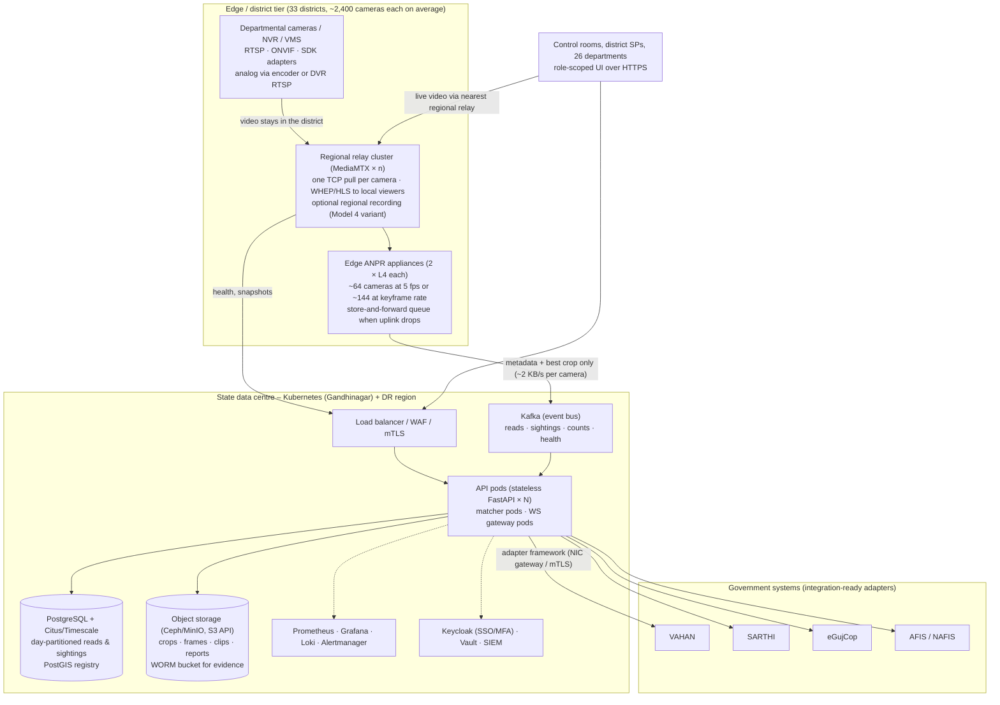

# Sentinel Gujarat — Plan for Scale (~80,000 cameras)

| | |
|---|---|
| **Programme** | Gujarat Police Innovation Challenge 2026 · CCTV Integration Hackathon ("Sentinel") |
| **Team** | Dynatech Consultancy · Category 2 |
| **Product** | Sentinel Gujarat `1.0.0-phase1` · Model 1 + Model 2 (hybrid roadmap to 3/4) |
| **Scope of this document** | Scalability strategy required by guide §7.2: central/regional/edge compute, GPU sizing, bandwidth and low-bandwidth strategy, hot/warm/cold storage by retention, load balancing and horizontal scaling, monitoring/logging/health checks, HA/backup/DR, cybersecurity controls, **estimated implementation and operational cost**, **cost-benefit**, **phased rollout**, and the **measured figures** from our Phase 1 soak that anchor the extrapolation |
| **Status** | Near-final draft, 5 September 2026. §1.1 carries the figures measured on the CPU-only laptop integration run; the two GPU rows are filled from the VM soak before PDF export |

All costs are order-of-magnitude planning estimates in Indian Rupees (₹ Cr = crore = 10⁷; ₹ L = lakh = 10⁵) at September 2026 list prices, before GST, excluding land and civil works. Every assumption is stated so that SCRB can re-run the arithmetic with its own numbers.

---

## 1. Starting point: what Phase 1 proves

Phase 1 runs the entire stack — relay, API, database, ANPR live and pre-index workers, web — on **one VM** for ~50 sandbox cameras plus our own feed. The scale-out design below keeps the same containers and contracts and changes only **where they run and how many there are**. Nothing is redesigned between the pilot and the statewide estate; that is the PoC-readiness argument.

### 1.1 Measured figures from the Phase 1 soak

| Figure | Where measured | Value | Planning value used below |
|---|---|---|---|
| Cameras per T4-class GPU at 5 fps (live mode) | `anpr-live-gpu` heartbeat `fps_actual` ≥ 4.5 on N cameras | not measured in Phase 1 (no GPU on the integration laptop); to be filled from the VM soak | 16 |
| Cameras per T4-class GPU at keyframe rate (pre-index) | `anpr-preindex-gpu` heartbeat | not measured in Phase 1 (no GPU); to be filled from the VM soak | 36 |
| Cameras per 8-core CPU-only host at 2–3 fps | `anpr-live` with `CPU=1` on the laptop | **8 cameras** decoded at 5 fps each (40 fps), 19–21 frames/s inferred (≈ 2.5 fps per camera effective) on 2.7 cores of a 12-thread i5-1345U, PaddleOCR 270–470 ms/crop; 2.0–2.3 GB RSS | 3 |
| Detections (reads) per second sustained by one API process | soak: `reads.last_1h / 3600` from `/dashboard/stats` while worker fps stayed nominal | content-bound on the mock (0.3 reads/s from 8 loops); measured **cost** 15–40 ms per `/internal/detections` batch and 12–20 ms per snapshot at ≈ 16 internal requests/s and 8–14 % of one core ⇒ ≥ 100 batches/s per core before saturation | 150 |
| DB size per 1,000 sightings (rows + indexes, incl. reads) | `pg_total_relation_size` on `sightings` + `plate_reads` ÷ count | **2.5 MB** (794 KB for 314 sightings + 315 reads; small-table index overhead included) | 1.2 MB |
| Crop + best-frame bytes per sighting | `du` of `/data/crops`, `/data/frames` ÷ sightings | **7.1 KB crop, 30.7 KB frame** (JPEG q70, 960 px frames of the 720p synthetic loops) | 20 KB crop, 80 KB frame |
| Read → alert on screen latency | `alerts.latency_ms` p50 / p95 over 24 h | **p50 3.3 s / p95 4.0 s / max 4.1 s** (steady state, 8 cameras, n = 13); the 3 s vote window + 1 s batch period dominate, matcher + WebSocket < 100 ms | ≤ 5 s read → screen (3 s vote window + 1 s batch + matcher < 100 ms); ≈ 2 s achievable with `ANPR_VOTE_WINDOW_S=1` at lower read accuracy |
| Onboarding time for 50 cameras (catalogue → registry → first stream) | import summary `duration_ms`, `first_stream_ready_ms` | **2 566 ms** (`duration_ms`) for 50 cameras + 61 relay paths on the fresh clone, of which **2 066 ms** (`first_stream_ready_ms`) was the first on-demand stream; rerun with 50 unchanged 14–44 ms | 5 s / 3 s |
| Relay: concurrent WebRTC viewers per relay core | wall test, `docker stats` on `mediamtx` | 9 WHEP viewers + 9 RTSP readers (ANPR) + 9 recorded paths + 1 libx264 transcode at **15–80 % of one core** (720p, ~300 kbps) ⇒ ≥ 40 viewers per core is conservative | 40 per core |
| Recording bytes per camera-hour (720p/1080p) | `recordings_used_bytes` ÷ camera-hours | **≈ 120 MB per camera-hour** for the 720p synthetic loops (~300 kbps fMP4); real 1080p cameras at 2 Mbps scale to the planning value | 0.9 GB/h at 2 Mbps |

The measured cells come from the 5 Sept 2026 integration run on the CPU-only laptop (acceptance checks 5, 12, 13, 14; `docs/acceptance-log.md`, README "Measured on a 12-core laptop"); the GPU rows are filled from the VM soak (`scripts/soak_run.sh`) before submission. The planning values are conservative vendor-data figures that the measurement is expected to match or beat.

---

## 2. Target topology

Source: `docs/diagrams/07-scale-topology.mmd`.



### 2.1 Three tiers

| Tier | Runs | Why there |
|---|---|---|
| **Edge / district** (33 district PoPs; large corporations — Ahmedabad, Surat, Vadodara, Rajkot — get 2–4 PoPs each) | MediaMTX relay cluster; ANPR appliances (`anpr-live`, `anpr-preindex` containers, unchanged); local snapshot cache; optional regional recording | Video is pulled once, close to the camera, and **never crosses the state backbone**; 4G/remote sites terminate locally; failure of the WAN degrades to store-and-forward, not loss |
| **Central / state data centre** (Gandhinagar; Kubernetes) | API, matcher, WebSocket gateway, importers, reports, retention; Kafka; PostgreSQL (Citus or TimescaleDB); object storage; observability; identity | Single registry, single watchlist, statewide search and route; one place to secure, audit and back up |
| **DR region** (second state data centre, e.g. Ahmedabad/GSDC-2) | Warm standby of the central tier; streaming DB replica; object-storage replication | RPO ≤ 5 min, RTO ≤ 60 min for the core; edge tiers continue to run and buffer during a central outage |

### 2.2 What changes from Phase 1 (and what does not)

| Component | Phase 1 | At scale | Change needed |
|---|---|---|---|
| Relay | 1 MediaMTX | n per district behind a TCP load balancer; path ownership sharded by camera id; the API's `MEDIAMTX_API_URL` becomes a per-district relay registry | Small: `mediamtx_client` gains a "which relay owns camera X" lookup |
| ANPR worker | 2 containers on one GPU | Same containers on appliances; `ANPR_CAMERAS` already splits cameras per worker; config from `/internal/anpr-config` already supports many workers | None in the worker; a scheduler assigns cameras to appliances |
| Worker → API | Direct HTTP POST | POST to a district-local **ingest gateway** that writes to Kafka (`reads`, `sightings`, `counts`, `events` topics) and stores crops in object storage; the API consumes Kafka | New thin service; the multipart contract is unchanged |
| API | Single process, in-process matcher and WS fan-out | Stateless pods behind a load balancer; matcher as a Kafka consumer group partitioned by plate hash; WS fan-out through Redis/NATS pub-sub; APScheduler jobs move to Kubernetes CronJobs | Moderate; the REST/WS contracts do not change |
| Database | One PostgreSQL | PostgreSQL with Citus (shard by `camera_id`) or TimescaleDB hypertables on `plate_reads`, `sightings`, `object_counts`, `camera_health_log`; day partitions; compression after 7 days; registry tables unsharded | Schema unchanged; partitioning DDL |
| Files | `/data` volume | S3-compatible object storage (Ceph RGW / MinIO); `/media/*` becomes signed-URL redirects | `storage.py` gains an S3 backend |
| Web | Caddy on the VM | Ingress + CDN for static assets; WebRTC/HLS served by the **nearest district relay** (the `/streams/{id}` response already carries the play URLs) | Routing only |

---

## 3. GPU / accelerator sizing (the arithmetic)

### 3.1 Per-GPU capacity

Basis: NVIDIA T4 (NVDEC ≈ 24 concurrent 1080p25 H.264 decodes, ≈ 18 H.265; 65 TFLOPS FP16) and NVIDIA L4 (2 × NVDEC engines, ≈ 2× T4 decode; 242 TFLOPS FP16 ≈ 3.7× T4). Measured inference: plate detector YOLO-v9-t-384 ≈ 5 ms/frame FP16 on T4; YOLOX-s 640 ≈ 4 ms; OCR ≈ 25 ms per crop on one CPU core (PaddleOCR CPU wheel), 2 crops/s per busy camera.

**Live mode, 5 fps, 1080p:**

```
Decode budget   : 24 streams per T4 (full-rate decode; the fps filter drops after decode)
Inference budget: 1000 ms / 5 ms = 200 detector frames/s ⇒ 200 / 5 fps = 40 cameras
                  + object detection every 5th frame: 40 cams × 1 fps × 4 ms = 16 % of GPU
Limiting factor : decode ⇒ 24 cameras theoretical; plan 16 cameras/T4 (67 % headroom for H.265, bursts)
```

**Keyframe (pre-index) mode, ~1 fps:**

```
Decode with -skip_frame nokey : ≈ 1/20 of full decode (GOP 20–50) ⇒ decode is not the limit
Inference: 1 fps × 5 ms ⇒ 200 cameras/GPU theoretical
CPU demux/RTSP per stream ≈ 1.5 % of a core ⇒ 32-core host ≈ 150 streams
Plan 36 cameras/T4 (memory, OCR CPU, jitter headroom)
```

**OCR on CPU:** 16 cameras × 2 crops/s × 25 ms = 0.8 core-s/s ⇒ 1 core per 16 live cameras; negligible at keyframe rate.

### 3.2 Camera profiles for 80,000 cameras

| Profile | Share | Cameras | Mode | Cameras per T4-eq | T4-equivalents |
|---|---|---|---|---|---|
| A · Road-facing, ANPR-relevant (checkposts, junctions, highways, gates) | 20 % | 16,000 | live 5 fps | 16 | 1,000 |
| B · Other cameras worth indexing (campuses, bus stands, hospital gates, markets) | 80 % | 64,000 | keyframe ~1 fps | 36 | 1,778 |
| **S1 · Mixed profile (reference)** | | **80,000** | | | **2,778** |
| S0 · Everything at keyframe rate only | | 80,000 | keyframe | 36 | 2,222 |
| S2 · Only road-facing analysed; the rest health + viewing only | | 16,000 analysed | live 5 fps | 16 | 1,000 |

### 3.3 Conversion to hardware

```
L4 ≈ 2 T4-equivalents for decode (the binding constraint) ⇒ S1: 2,778 / 2 = 1,389 L4 GPUs
Appliance = 2 × L4 + 32-core CPU + 128 GB RAM + 2 × 10 GbE (≈ ₹16 L) ⇒ S1: 695 appliances
                                                                        S0: 556 appliances
                                                                        S2: 250 appliances
Per district (33): S1 ≈ 21 appliances on average; Gandhinagar (≈ 800 cameras) ≈ 7; Ahmedabad (≈ 12,000) ≈ 105
```

Capacity per appliance: **64 cameras at 5 fps** or **144 at keyframe rate** (or any mix). A DeepStream- or TensorRT-based worker would raise these numbers; the plan does not depend on it.

### 3.4 CPU-only fallback

Where a GPU cannot be placed (very small PoPs, 4G sites), the CPU path (`CPU=1`) handles ~3 cameras at 2–3 fps per 8 cores, i.e. a 32-core box ≈ 12 cameras — used for health, snapshots and low-rate ANPR on a handful of gates.

---

## 4. Bandwidth planning and low-bandwidth strategy

### 4.1 Aggregate video

```
80,000 cameras × 2 Mbps (1080p H.264 typical; H.265 ≈ 1 Mbps; 720p ≈ 1 Mbps) = 160 Gbps
                × 4 Mbps (worst case, high-motion 1080p25)                          = 320 Gbps
```

This traffic is **intra-district**: camera → district PoP over the department's LAN/fibre/leased line or the GSWAN district ring. Per district average `2,400 × 2 Mbps ≈ 4.8 Gbps` (Ahmedabad ≈ 24 Gbps across several PoPs). Non-analysed cameras are pulled **on demand only** (idle → no traffic).

### 4.2 Metadata to the centre

```
Sightings/day ≈ 16,000 road cameras × 300 vehicles/h (24 h average) × 24 = 115 M/day
Per sighting to centre: ≈ 1 KB JSON + 20 KB best crop = 21 KB
Daily volume ≈ 115 M × 21 KB ≈ 2.4 TB/day ≈ 224 Mbps average, ≈ 700 Mbps at 3× peak
Per-read crops (≈ 3 per sighting) stay at the district for 7 days (regional object storage)
```

Two redundant 1 Gbps links per district into the state backbone suffice; 10 Gbps at the centre with headroom. Live viewing is served by the **nearest district relay** (operators mostly watch their own district); cross-district viewing of a camera costs one 2 Mbps flow across the backbone per viewer, capped by relay policy.

### 4.3 Low-bandwidth and low-connectivity operation

| Technique | Effect | Where |
|---|---|---|
| Keyframe-only pull (`-skip_frame nokey`, I-frame every 1–2 s) | ≈ 100–200 kbps per camera instead of 2 Mbps | Profile B cameras on 4G/leased lines |
| Camera sub-stream (D1/CIF, 512 kbps) as the registered `rtsp_url` | 4× less traffic; ANPR only for large frontal plates | Border/remote districts |
| Snapshot mode (1 fps JPEG, ~50–100 kbps) | Viewing without video | Wall tiles 5–16, mobile users |
| On-demand relay (close after 60 s idle) | Zero traffic for idle cameras | All non-analysed cameras |
| Edge inference, metadata-only uplink (~2 KB/s per camera) | 1,000× reduction versus centralising video | Every district |
| Store-and-forward queue on the appliance (SQLite/Kafka local, hours of buffer) | No loss during WAN outages; alerts fire when the link returns | Every district |
| Scheduled analytics windows | Analyse a camera only in its relevant hours | Markets, schools |

---

## 5. Storage tiers by retention

### 5.1 Metadata and evidence (Topology A — Model 2 at scale)

| Data | Rate | Retention | Volume | Store |
|---|---|---|---|---|
| Sightings | 115 M/day × ≈ 400 B (row + indexes) = 46 GB/day | 1 year hot in PostgreSQL (day partitions, compressed after 7 days ≈ 10×), then Parquet in object storage | 17 TB/year uncompressed ≈ 2–3 TB compressed | PostgreSQL (Citus/Timescale) NVMe |
| Reads | ≈ 3 × sightings ≈ 345 M/day × 400 B = 138 GB/day | 30 days | 4.1 TB | PostgreSQL |
| Best crops | 115 M/day × 20 KB = 2.3 TB/day | 30 days centrally | 69 TB | Object storage (central) |
| Per-read crops and best frames | 345 M × 20 KB + 115 M × 80 KB ≈ 16 TB/day | 7 days regionally | 112 TB total across districts | Object storage (district) |
| Object counts, health logs, events, audit | < 20 GB/day | 90 days / 7 days / 2 years / 7 years (audit) | < 5 TB | PostgreSQL |
| Evidence clips, reports, exports | operator-driven; ≈ 5 MB per clip | 90 days by default; **legal hold** per case indefinitely | ≈ 20 TB | WORM object bucket |
| **Total** | | | **≈ 150 TB central + 120 TB regional usable**, ≈ 400 TB raw with 3× replication / EC | |

### 5.2 Video recording (Topology B — Model 4 option)

```
Per camera-day at 2 Mbps: 2 Mbps × 86,400 s / 8 = 21.6 GB
Department retention policy assumed: 30 % of cameras 7 days, 50 % 15 days, 20 % 30 days
Camera-days retained = 24,000×7 + 40,000×15 + 16,000×30 = 168,000 + 600,000 + 480,000 = 1,248,000
Usable capacity = 1,248,000 × 21.6 GB ≈ 27 PB     (52 PB if every camera kept 30 days)
Raw with erasure coding 8+3 (73 % efficiency) ≈ 37 PB
```

| Tier | Content | Retention | Capacity | Medium |
|---|---|---|---|---|
| **Hot** | Last 24 h of profile-A cameras (instant seek from alerts) | 1 day | 16,000 × 21.6 GB ≈ 345 TB | NVMe/SSD at district PoPs |
| **Warm** | All cameras per department policy | 7 / 15 / 30 days | ≈ 27 PB usable (37 PB raw) | HDD Ceph EC 8+3, 20 TB drives; 37 PB ÷ 480 TB ≈ 77 servers of 24 drives (92 with 20 % headroom) |
| **Cold / legal hold** | Exported clips, case footage, hash manifests | Case lifecycle (years) | ≈ 50 TB/year | WORM object lock; optional LTO-9 tape |

Recommended variant: **record at the district PoP** (same Ceph pools, distributed) and index centrally (segment index + SHA-256 per segment); only requested clips traverse the backbone. Central recording is costed as the alternative because the portal's Model 4 wording asks for it.

---

## 6. Load balancing, horizontal scaling, monitoring, HA, backup, DR

### 6.1 Load balancing and horizontal scaling

| Layer | Mechanism | Scale unit |
|---|---|---|
| HTTPS/WSS ingress | L7 load balancer (HAProxy / ingress-nginx) with sticky WebSocket sessions; WAF in front | +1 ingress pod per 5,000 concurrent users |
| API | Stateless FastAPI pods, HPA on CPU and request latency | 150 reads/s per pod (planning value; measured cost 15–40 ms per detection batch per core, §1.1) ⇒ 32 pods for 4,800 reads/s statewide + 2× headroom = 64 pods |
| Matcher | Kafka consumer group; partitions keyed by plate hash; in-memory watchlist per pod (≤ 1 M entries ≈ 200 MB) | +1 pod per 10 partitions |
| WebSocket gateway | Redis/NATS pub-sub; each gateway serves its connected users with scope filtering | +1 pod per 2,000 sockets |
| Relay | Per-district MediaMTX behind an L4 balancer; camera → relay assignment stored in the registry | 500 cameras (or 2,000 viewer sessions) per 32-core relay |
| ANPR | Appliance scheduler assigns cameras to appliances by load; a failed appliance's cameras are re-assigned within 2 min | 64 live / 144 keyframe cameras per appliance |
| Database | Citus coordinator + workers (shard on `camera_id`), read replicas for dashboards/search; PgBouncer | +1 worker per 10 TB |
| Object storage | Ceph RGW / MinIO with EC; per-district clusters + central | +1 node per 500 TB |

### 6.2 Monitoring, logging and health checks

| Concern | Tooling | Signals |
|---|---|---|
| Metrics | Prometheus + Grafana; exporters for PostgreSQL, Kafka, Ceph, node, NVIDIA DCGM; MediaMTX metrics endpoint | reads/s, alert latency p95, worker `fps_actual`, decoder restarts, relay bytes, GPU utilisation, queue lag |
| Logs | Loki (containers already log JSON lines) | structured request logs, worker heartbeats, audit mirror |
| Traces | OpenTelemetry → Tempo (read → alert critical path) | latency breakdown |
| Health checks | `/healthz` on every service (already present); Kubernetes liveness/readiness; synthetic probes (login, search, WHEP) from each district | availability SLO 99.9 % core, 99.5 % per district |
| Camera health | The existing poller per district (MediaMTX ready + ffprobe) → `camera_health_log` → dashboards, offline alerts, AMC lists | uptime % per camera / department / district |
| Alerting | Alertmanager → NOC (24×7) via e-mail/SMS/Telegram; runbooks per alert | |

### 6.3 High availability

- Kubernetes control plane ×3, worker nodes across ≥ 2 racks; PodDisruptionBudgets for API/matcher/WS.
- PostgreSQL primary + synchronous standby (Patroni), automatic failover; read replicas.
- Kafka 3 brokers, replication factor 3, min ISR 2.
- Ceph with EC 8+3 across ≥ 12 nodes; MinIO alternative with 4+2.
- District relay clusters n+1; appliances n+1 per district; camera re-assignment on failure.
- Edge continues autonomously (local alerts to the district control room) when the centre is unreachable.

### 6.4 Backup and disaster recovery

| Item | Backup | DR |
|---|---|---|
| PostgreSQL | WAL archiving to object storage every 5 min; nightly base backup; PITR 30 days; quarterly restore drill | Streaming replica in the DR region; RPO ≤ 5 min, RTO ≤ 60 min |
| Object storage | Versioned buckets; evidence bucket with object lock (WORM) | Cross-region replication of central buckets (crops 30 d, evidence forever) |
| Configuration | GitOps (Argo CD); secrets in Vault with HSM-backed unseal | Re-deployable from git in < 1 h |
| Kafka | Retention 3 days (replayable) | MirrorMaker to DR |
| Recordings (Topology B) | Not backed up (retention policy is the backup); evidence clips are | Regional recording is inherently distributed |

Phase 1 already does nightly `pg_dump` and a VM snapshot before submission.

---

## 7. Cybersecurity controls

| Domain | Control |
|---|---|
| Identity | Keycloak SSO (state directory / OTP), **MFA for admin and operator**, short-lived JWTs, per-department admins (already implemented as `dept_admin` scoping in SQL) |
| Network | Segmentation: camera VLANs → relay DMZ → core; only RTSP/ONVIF allowed from relay to camera networks; mTLS between tiers; WAF and rate limiting on ingress; no inbound port on appliances |
| Data | TLS 1.2+ in transit everywhere; at-rest encryption (LUKS on nodes, SSE on object storage, TDE-equivalent via encrypted volumes for PostgreSQL); credentials masked; secrets in Vault |
| Application | The Phase 1 controls (permission matrix, scoped queries, API-key scopes, path allow-lists, input validation, append-only audit, SHA-256 evidence) carried unchanged |
| Operations | Vulnerability scanning of images (Trivy) in CI; signed images; CIS-benchmarked nodes; patch windows; SIEM ingestion of audit and access logs; privileged access management for DB and node access |
| Compliance | Audit retention 7 years; export watermarking and purpose notices; retention classes per department; periodic access reviews from the audit log; incident response runbook |

---

## 8. Cost estimate

### 8.1 Unit-cost assumptions

| Item | Unit cost (₹) | Basis |
|---|---|---|
| Edge ANPR appliance (2 × NVIDIA L4, 32 cores, 128 GB, 2 × 10 GbE, 2 × 1.9 TB NVMe) | 16 L | L4 ≈ 3.5 L each + server 9 L |
| Relay / ingest server (32 cores, 64 GB, 4 × 10 GbE) | 6 L | |
| Kubernetes worker node (32 cores, 256 GB, NVMe) | 8 L | |
| Database node (32 cores, 512 GB, 8 × 3.8 TB NVMe) | 15 L | |
| Object-storage node (24 × 20 TB HDD, 480 TB raw) | 18.4 L | drives 8.4 L + chassis 10 L |
| District network kit (switches, firewall pair, UPS) | 40 L per PoP | |
| Power | ₹8 per kWh, PUE 1.5 | |
| Hardware AMC / support | 10 % of hardware capex per year | |
| Operations staff | NOC 24×7 (12), L2/L3 engineers (18), data/ML (5), security (4), programme (6) ≈ 45 FTE at ₹20 L average fully loaded | 9 Cr/year |
| Software licences | **₹0** (all open source) | commercial support subscriptions optional (PostgreSQL, Kubernetes) budgeted under "support" |

### 8.2 Topology A — metadata-only edge ANPR (Model 2 at scale; **recommended first**)

**Capital expenditure (one-time, 80,000 cameras, mixed profile S1)**

| Line | Quantity | ₹ Cr |
|---|---|---|
| Edge ANPR appliances | 695 × 16 L | 111.2 |
| District relay / ingest servers | 160 × 6 L (≈ 500 cameras each) | 9.6 |
| District network kit | 33 PoPs + 7 extra city PoPs = 40 × 40 L | 16.0 |
| Central Kubernetes (API, matcher, WS, Kafka, observability) | 40 × 8 L | 3.2 |
| Central database cluster (Citus/Timescale, 3 + 6 nodes) | 9 × 15 L | 1.4 |
| Object storage (central 150 TB + district 120 TB usable ⇒ ≈ 400 TB raw) | 12 × 18.4 L | 2.2 |
| DR region (50 % of central compute + storage replica) | | 4.0 |
| Security stack (WAF, SIEM, PAM, HSM, Vault) | | 5.0 |
| Implementation services: 80,000-camera onboarding, adapters (ONVIF, 6 vendor SDKs), VAHAN/SARTHI/eGujCop connectors, training, documentation | | 25.0 |
| Contingency 10 % | | 17.8 |
| **Total capex** | | **≈ 195** |

**Operational expenditure (per year)**

| Line | Basis | ₹ Cr/yr |
|---|---|---|
| Power and cooling | 695 × 1.2 kW + 160 × 0.5 kW + central 150 kW ≈ 1.06 MW × PUE 1.5 × 8,760 h ≈ 14 GWh × ₹8 | 11.2 |
| Hardware AMC / support incl. optional OSS subscriptions | 10 % of ≈ 153 Cr hardware | 15.3 |
| Operations team (45 FTE) | | 9.0 |
| WAN (incremental metadata links, 2 × 1 Gbps per PoP; video stays local) | 40 PoPs × 12 L | 4.8 |
| Data-centre space (district racks + state DC) | | 4.0 |
| Model retraining, annotation, QA | | 1.5 |
| Software licences | open source | 0 |
| **Total opex** | | **≈ 46** |

Per camera: **≈ ₹24,000 capex + ₹5,800/year opex**. For comparison, a new IP camera installation is ₹60,000–1,20,000 per camera: the platform re-uses the existing estate instead of replacing it.

### 8.3 Topology B — central recording at the state data centre (Model 4 option)

Adds to Topology A:

| Line | Quantity | ₹ Cr |
|---|---|---|
| Warm recording storage 37 PB raw (Ceph EC 8+3) | 92 × 18.4 L (77 servers + 20 % headroom) + 100 GbE fabric 10 Cr | 26.9 |
| Hot tier 345 TB NVMe | | 4.0 |
| Recording ingest servers (160–320 Gbps) | 100 × 8 L | 8.0 |
| State backbone upgrade to carry 160 Gbps of video (assumption: GSWAN DWDM/100G ring upgrade share) | | 60.0 |
| Larger state DC (power +200 kW, space) | | 10.0 |
| Contingency 10 % on the additions | | 10.9 |
| **Additional capex** | | **≈ 120** ⇒ **total ≈ 315** |

| Additional opex | Basis | ₹ Cr/yr |
|---|---|---|
| Backbone bandwidth | 160 Gbps statewide | 25.0 |
| Storage AMC (10 % of 31 Cr) + drive replacement (3 %/yr of drives) | | 3.6 |
| Power for storage + ingest (92 × 0.8 kW + 100 × 0.5 kW ≈ 125 kW × PUE 1.5) | | 1.3 |
| Additional operations (storage team, 8 FTE) | | 1.6 |
| **Additional opex** | | **≈ 32** ⇒ **total ≈ 78/yr** |

Per camera: ≈ ₹39,400 capex + ₹9,750/year. The **regional-recording variant B'** (record at district PoPs, index centrally) removes the backbone upgrade and its bandwidth line and needs a smaller state DC (additions ≈ 27 + 4 + 8 + 5 = 44 Cr + 10 % ⇒ ≈ 48 Cr): ≈ ₹243 Cr capex, ≈ ₹53 Cr/yr opex.

### 8.4 Summary

| Topology | Capex (₹ Cr) | Opex (₹ Cr/yr) | 5-year TCO (₹ Cr) | Per camera 5-yr |
|---|---|---|---|---|
| A · Metadata-only edge ANPR (Model 2 at scale) | ≈ 195 | ≈ 46 | ≈ 425 | ≈ ₹53,000 |
| B · Central recording (Model 4) | ≈ 315 | ≈ 78 | ≈ 705 | ≈ ₹88,000 |
| B' · Regional recording, central index | ≈ 243 | ≈ 53 | ≈ 508 | ≈ ₹63,500 |

All figures ± 30 % until the pilot's measured values replace the planning values and vendor quotations replace list prices.

---

## 9. Cost-benefit analysis

FAQ Q24 asks for cost-benefit, not only cost. Benefits are estimated conservatively; the assumptions are explicit so SCRB can substitute its own case statistics.

| Benefit | Assumption | Annual value |
|---|---|---|
| **Operator hours saved per vehicle trace** | Today a multi-department trace (identify cameras, request footage from each department, review hours of video) costs ≈ 3 person-days (24 h); with the platform ≈ 15 min. Statewide traces ≈ 6,000/year | 6,000 × 23.75 h ≈ 142,000 h ≈ 70 FTE ≈ ₹14 Cr/yr |
| **Faster stolen-vehicle response** | Real-time alert instead of post-facto search; recovery probability rises materially when interception happens within minutes. Gujarat reports ≈ 20,000 vehicle thefts/year (assumption); if the platform raises recovery by 5 percentage points at ₹3 L average value | 1,000 × ₹3 L = ₹30 Cr/yr of recovered property |
| **Reuse of existing cameras — no re-cabling, no replacement** | 80,000 cameras already installed; platform onboarding ₹24 k/camera vs new ANPR camera installation ₹1 L+ | Avoided capex ≈ ₹600 Cr versus a green-field ANPR estate of the same size |
| **One inventory for 26 departments** | Gap-analysis and ageing reports direct new camera budgets to uncovered POIs and replace only what is broken; assume 10 % better allocation of an annual statewide CCTV budget of ₹200 Cr | ₹20 Cr/yr |
| **Evidence-grade exports** | Hashed, watermarked, audited exports reduce evidentiary challenges and re-work; assume 500 cases/year avoid 2 person-days each | ₹0.5 Cr/yr + qualitative (conviction quality) |
| **Camera uptime** | Health monitoring and AMC tracking raise the working share of the estate; every 1 % of uptime on 80,000 cameras equals 800 cameras that would otherwise be dark | 1 % ≈ ₹8 Cr of installed value kept useful |
| **Open source** | Zero per-camera VMS/analytics licence versus ₹5,000–15,000 per camera per year for commercial VMS + ANPR | ₹40–120 Cr/yr avoided |

Against Topology A's ≈ ₹46 Cr/yr opex and ≈ ₹39 Cr/yr amortised capex (5 years), the quantified benefits (≈ ₹65 Cr/yr direct, plus avoided licence and capex) give a payback inside the first two years of statewide operation, before counting deterrence and investigation quality.

---

## 10. Phased rollout

| Phase | Scope | Cameras (cumulative) | Duration | Infrastructure added | Cumulative capex (₹ Cr) | Exit criteria |
|---|---|---|---|---|---|---|
| **0 · Sandbox / Grand Finale** | Organiser feeds, own camera; single VM | ~50 | Sept 2026 | 1 GPU VM | 0.05 | Phase 1 checklist green; Phase 2 route test passed |
| **1 · Gandhinagar pilot** | Police, Health, GSRTC, Municipal, Panchayat cameras in Gandhinagar district; one district PoP; central tier in the state DC (small) | **500** | 3 months | 8 appliances, 2 relays, minimal Kubernetes (6 nodes), 3-node DB, 100 TB object storage | ≈ 7 | Measured figures replace planning values; 99.5 % availability for 30 days; dept_admin workflows signed off by 5 departments; eGujCop watchlist import live |
| **2 · Four corporations** | Ahmedabad, Surat, Vadodara, Rajkot + highway checkposts between them; Kafka + Citus introduced; ONVIF + 2 vendor SDK adapters; VAHAN/SARTHI connectors (credentials permitting) | **5,000** | +6 months | ≈ 45 appliances, 12 relays, 8 PoPs, DR region stood up | ≈ 25 | Cross-district route reconstruction in production; p95 read → alert ≤ 5 s (≤ 2.5 s on corridors where a 1 s vote window is acceptable); DR failover drill passed |
| **3 · All corporations + border districts** | All 8 municipal corporations, RTO checkposts, border districts (Valsad, Dahod, Gir Somnath, Jamnagar, Devbhumi Dwarka, Kutch) with low-bandwidth mode; 4 more vendor adapters; regional recording option decided | **25,000** | +9 months | ≈ 220 appliances, 50 relays, 20 PoPs | ≈ 85 | 20 of 26 departments onboarded; load test at 25 k with synthetic feeds; audit and privacy review passed |
| **4 · Statewide** | All 33 districts, 26 departments, private/public-facing feeds where permitted; full HA/DR; 80 k load-test report (Model 4 deliverable) | **80,000** | +12 months (≈ 30 months total) | Remainder to 695 appliances, 160 relays, 40 PoPs | ≈ 195 | Statewide SLOs met for 90 days; handover to SCRB operations |

Each phase re-runs the same acceptance checks (`CONTRACT.md` §13.3) on the new tier before the next phase starts; the Phase 1 stack is the regression baseline.

---

## 11. Department-wise technical requirements (summary)

| Department type | Typical estate | Requirement on the platform | Profile |
|---|---|---|---|
| Home / Police (traffic, law & order, checkposts) | IP + ANPR cameras, some analog at old checkposts; NVR/VMS | 5 fps ANPR, recording hot tier, alert routing to control rooms | A |
| Municipal corporations / smart city | Large IP estates on city fibre, commercial VMS | Vendor adapters, keyframe indexing, viewing | A/B |
| GSRTC | Bus stands, depots | Keyframe indexing at gates, counts | B |
| Health | Hospital gates, OPDs | Keyframe indexing at gates, privacy-sensitive interiors excluded by policy | B |
| Panchayat & rural | Few cameras, 4G links, analog DVRs | Low-bandwidth mode, sub-streams, snapshot viewing | B (low-bw) |
| RTO | Testing tracks, checkposts | 5 fps ANPR at checkposts | A |
| Food & Civil Supplies | Godowns, PDS shops | Health + intrusion zones (roadmap) | B |
| Others (Education, Forest, GIDC, Ports, …) | Mixed | Registry + health first; analytics by request | B |

---

## 12. Risks specific to scale

| Risk | Mitigation |
|---|---|
| Camera estates unreachable from district PoPs (private networks) | Site survey in the questionnaire (HLD §19); per-department VPN or a small relay probe on-site |
| Vendor VMS refuses a second RTSP client or caps clients | Adapter uses the VMS export API; the relay's single connection is the maximum the platform ever opens |
| GPU supply / price volatility | Design is T4-equivalent based; any NVDEC-capable GPU works; CPU fallback for gates |
| Sightings table growth | Day partitions + compression + Parquet tiering; measured GB/1,000 sightings drives the DB sizing |
| Alert fatigue at scale | Priority floors, suppression windows, escalation only for critical/high; per-department routing |
| Backbone cost for central recording | Default to regional recording (B'); central recording only where policy demands |

---

*Sentinel Gujarat · Dynatech Consultancy · Plan for Scale v1.0.0-phase1 · Model 1 + Model 2 (hybrid roadmap to 3/4) · laptop figures measured 5 Sept 2026; GPU figures are replaced from the Phase 1 VM soak before submission.*
